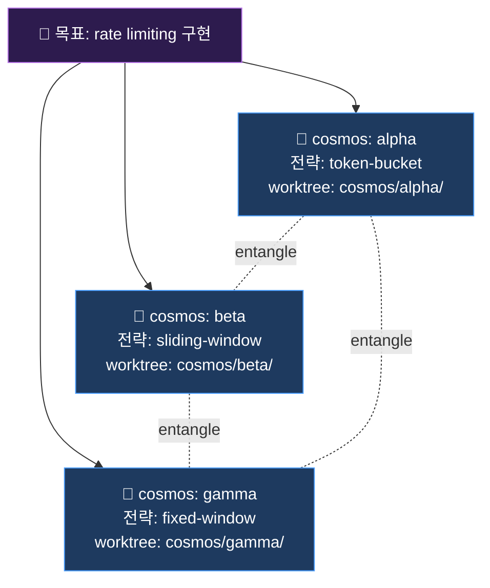
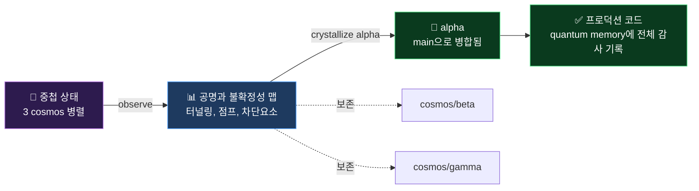

# 🌌 QuantumAgent

> 하나의 접근법에 확정짓기 전에, 세 가지를 동시에 탐색하세요.
>
> *Claude Code용 평행 cosmos 탐색 하네스.*

Claude Code 플러그인으로, 여러 AI 에이전트가 동시에 실행됩니다. 각자 같은 목표를
다른 전략으로 탐색하고, Quantum Memory를 통해 실시간으로 발견을 공유합니다.
독립적으로 같은 결론에 도달하면 — 그게 신뢰 신호입니다. 다르게 갈라지면 — 그게
실제 트레이드오프가 가시화된 것입니다.

```
/cosmos spawn --goal "사용자 인증 구현" --strategies "jwt,session,oauth2"
```

---

## 아키텍처 — Git-Native Orchestration

QuantumAgent의 설계는 **의도**와 **실행**을 분리합니다:

| 계층 | 위치 | 소유자 |
|---|---|---|
| **Control Plane** — 목표, 계획, 기억, 신호, 검토 | Git 작업 트리 (Markdown + JSONL) | QuantumAgent |
| **Effector Layer** — 외부 API, DB, 브라우저, 코드 실행 | 호스트 에이전트의 기본 도구 / MCP / CLI | 호스트 (Claude Code, Cursor, Aider, ...) |

QuantumAgent가 영속화하는 모든 것은 `cat`, `grep`, `git diff`, `git revert`가 가능한 평범한 파일입니다. 사이드 이펙트는 호스트 에이전트가 소유합니다. 이게 10+ 환경에 동일 워크플로가 이식되는 이유 — 이식할 독점 런타임이 없습니다.

---

## 한 번의 실행으로 얻는 것

일반적인 30분 실행 결과:

- **4~8개의 공명 결정** — 재논쟁 없이 바로 배포 가능한 결정들. 여러 독립 구현이 동의했습니다.
- **2~4개의 불확정성 결정** — 의식적으로 선택해야 할 진짜 트레이드오프가 명시화됩니다.
- **N개 브랜치의 작동하는 코드** — 이론적 비교가 아닌 실제 버그를 발견한 구현체들
- **[TUNNEL] / [JUMP] 돌파구** — 순차적 단일 에이전트로는 나오지 않을 해법들

신호 품질이 높은 이유: 발견이 이론화가 아니라 *실제 구현* 중에 나오기 때문입니다.
버그는 배포 후가 아니라 탐색 중에 표면화됩니다.

---

## 해결하는 문제

Claude Code로 무언가를 만들고 있습니다. Claude가 하나의 접근법으로 구현합니다.
배포합니다. 3주 후 아키텍처가 확장되지 않거나, 보안 엣지 케이스를 발견하거나,
다른 접근법이 더 나았을 거라는 걸 깨닫습니다.

문제는 Claude가 아닙니다 — 단일 에이전트가 단일 경로를 탐색하면, 탐색하지 않은
것을 알 수 없다는 구조적 한계입니다.

**QuantumAgent는 확정짓기 전에 탐색을 실행합니다.** 이론적 비교가 아니라 —
실제 작동하는 구현체로, 실제 코드에서 실제 문제를 발견하면서.

---

## 작동 원리

```
목표 (순수한 가능성 — 파동)
         │
         ▼
 /cosmos spawn --strategies "A,B,C"
         │
    ┌────┴──────────────────────────────────────┐
    │                                           │
    ▼               ▼                           ▼
cosmos:alpha    cosmos:beta               cosmos:gamma
전략 A          전략 B                    전략 C
    │               │                           │
    │   reads ◄─────┤──────────────────────► reads
    │               │           ↑               │
    ▼               ▼     .quantum/             ▼
 writes ──────────► * ◄────────────────── writes
    │               │                           │
    └────────────────────────────────────────────┘
         │
         ▼
 /cosmos observe
         │
         ├── ⚡ 공명    — 모든 전략이 독립적으로 동의 → 배포
         ├── 🌀 불확정성 — 전략이 진짜 갈라짐 → 개발자가 선택
         ├── ⚛️ 터널링  — 당연하다 여긴 제약이 우회됨 → 검토
         └── ⚡ 도약    — 단일 인사이트로 불연속적 전환 → 추적
         │
         ▼
 /cosmos crystallize <id>   →   슈뢰딩거 체크 → 병합 또는 보존
 /cosmos stop               →   모든 worktree 정리
```

핵심: 에이전트들은 결론만 공유하는 것이 아닙니다 — **발견을 실시간으로 공유합니다**.
cosmos:gamma가 7단계에서 보안 버그를 발견하면, cosmos:alpha는 8단계 전에 그것을 읽고
자신의 전략을 유지하면서 동일한 픽스를 적용합니다. 수렴 없는 영향력 — 그게 얽힘입니다.

---

## 🔭 Cosmos 실행 시각화

### 1. Spawn — 중첩 상태 형성

하나의 목표, 여러 병렬 cosmos, 각자 격리된 git worktree:



각 cosmos는 자기 `.quantum/<name>/insights.jsonl`에 append-only로 인사이트를 씁니다.
모든 cosmos는 주요 단계 사이마다 다른 cosmos의 인사이트를 읽습니다. 이게
**얽힘 채널** — 공유 가변 상태 없음, 병합 충돌 없음, 디스크 위의 브로드캐스트 로그만 있을 뿐.

### 2. Observe — 중첩 상태를 붕괴 없이 관측

`/cosmos:observe`는 비파괴 측정입니다. 모든 cosmos의 실시간 상태 + 양자 신호 맵을 출력:

```
🌌 Superposition Snapshot
═══════════════════════════════════════════════════════════════════

cosmos:alpha   (token-bucket)    ●●●●●●●●●  9 insights
  └ {"type":"tunnel","content":"Redis sorted sets로 rate-limit 테이블 자체가 불필요해짐"}
  └ {"type":"decision","content":"SLA 버킷에 밀리초 정밀도면 충분"}

cosmos:beta    (sliding-window)  ●●●●●●●●●● 10 insights
  └ {"type":"jump","content":"alpha의 audit 인사이트 읽고 event-sourcing으로 전환"}
  └ {"type":"decision","content":"SLA 버킷에 밀리초 정밀도면 충분"}

cosmos:gamma   (fixed-window)    ●●●●●●     6 insights
  └ {"type":"decision","content":"SLA 버킷에 밀리초 정밀도면 충분"}
  └ {"type":"blocker","content":"버스트 부하 시 경계 초 이중 카운트"}

⚡ 공명 (Resonance) ━━━━━━━━━━━━━━━━━━━━━━━━━━━━━━━━━━━━━━━━━━━━━
   "밀리초 정밀도" — 3개 cosmos 수렴 → 신뢰

🌀 불확정성 (Uncertainty) ━━━━━━━━━━━━━━━━━━━━━━━━━━━━━━━━━━━━━━
   자료구조: sorted-set (alpha) vs ring-buffer (beta) vs hash (gamma)
   → 진짜 트레이드오프, 개발자 선택

✨ 터널링 (Tunneling) ━━━━━━━━━━━━━━━━━━━━━━━━━━━━━━━━━━━━━━━━━━
   alpha: Redis sorted sets로 별도 rate-limit 테이블 대체

⚡ 양자 점프 (Quantum Jump) ━━━━━━━━━━━━━━━━━━━━━━━━━━━━━━━━━━━━
   beta ← alpha: 구현 중 event-sourcing으로 전환

🚧 미해결 차단 (Unresolved Blockers) ━━━━━━━━━━━━━━━━━━━━━━━━━━━
   gamma: 버스트 부하 시 경계 초 이중 카운트
```

> 위 출력은 [`skills/observe/SKILL.md`](skills/observe/SKILL.md) 에 정의된 형식입니다. 실제 실행은 진짜 내용이 들어가고, 구조와 신호 카테고리만 고정됩니다.

### 3. Crystallize — 한 cosmos를 결과물로 붕괴



`/cosmos:crystallize alpha`는 한 cosmos를 결정적 결과로 붕괴시키고 브랜치를 병합합니다.
**다른 cosmos들은 자기 브랜치에 그대로** — 참조용이나 후속 crystallize 대상으로 보존됩니다.

### 4. 양자 신호 — 무엇을 봐야 하는가

| 신호 | 의미 | 액션 |
|---|---|---|
| ⚡ **공명** | N개 cosmos가 독립적으로 같은 결론에 도달 | 자신감 있게 ship |
| 🌀 **불확정성** | cosmos가 결정에서 갈림 | 진짜 트레이드오프 — 개발자 선택 |
| 🔁 **축퇴** | 다른 전략이 기능적으로 동일한 구현 생성 | 자연 유일해 존재 |
| ⚠️ **결깨짐** | cosmos가 다른 cosmos를 복사하며 전략 상실 | 표본 가치 상실 |
| ✨ **터널링** (`type: "tunnel"`) | 가정된 제약을 우회하는 해법 | 예상 외 경로 |
| ⚡ **양자 점프** (`type: "jump"`) | 단일 얽힘 읽기가 불연속적 전환 유발 | 비자명한 아키텍처 도약 |
| 🧊 **보즈-아인슈타인 응축** | 불확정성 0 + 공명 결정 ≥3 + 모든 cosmos 참여 | 목표가 결정론적 — 어느 cosmos든 ship |

### 5. 실제 실행 사례 보기

---

## 🛰️ 대표 사례 — [`examples/auth-audit/`](examples/auth-audit/)

> **프로덕션 Electron + Next.js 결제 단말 코드베이스에 대한 3-cosmos 보안 감사.**
> 2회 실행. 실제 소스. verbatim observe 출력 포함.

| 3 cosmos | 2 라운드 | CRITICAL 5건 | [TUNNEL] 1건 | 가공 인사이트 0건 |
|:---:|:---:|:---:|:---:|:---:|
| security-threat<br/>code-architecture<br/>offline-resilience | 의도적 재 spawn으로<br/>시그널 안정성 검증 | JWT 무만료, revocation 단절,<br/>평문 토큰 저장 등 | Electron CORS<br/>와일드카드 인젝션 | 모든 `.jsonl` 줄은<br/>에이전트가 실제로 출력한 것 |

### 1차 라운드 발견

> ### ⚡ 3-way 공명 — *"토큰에 만료가 없고, revocation은 stateless JWT에 무력하며, 토큰은 평문 저장. 셋이 서로를 강화한다."*
>
> 세 cosmos가 서로 다른 렌즈로 독립적으로 같은 결론에 도달했습니다. **국소 버그가 아닌 시스템적 결함.** 단발 패치가 아니라 한 묶음으로 ship해야 합니다.

추가: `platform_admin` 자가 등록 (OWASP A01), `cancel-request`의 `body.termId` 스푸핑, `/api/terminals` cross-tenant IDOR, 중앙 디스패처 없이 공존하는 3개 인증 스킴.

### 2차 라운드가 추가한 발견 — *재 spawn의 가치*

> ### ✨ `[TUNNEL]` — `electron/main.js`의 Electron CORS 와일드카드 인젝션
>
> 응답에 `Access-Control-Allow-Origin` 헤더가 없으면 메인 프로세스가 **`*`와 `Authorization` 헤더 허용을 주입**합니다. XSS 또는 공급망 침해 시 bearer 토큰이 공격자가 제어하는 origin으로 송출 가능합니다.
>
> **1차 라운드는 이를 완전히 놓쳤습니다.** 단 한 번의 재 spawn으로 표면화됐습니다.

추가: `terminals/[id]/account|key` PUT 라우트의 merchant 소유권 미검증 → cross-tenant **쓰기** 경로 → 전체 계정 takeover. 1차에서 도달하지 못한 또 하나의 Critical.

### 왜 이 사례가 중요한가

- **공명은 실재한다.** 세 개의 독립 전략, 세 개의 다른 렌즈, 같은 결론. 단일 sub-agent로는 얻을 수 없는 시그널입니다.
- **재 spawn은 선택이 아니다.** 가장 위험한 발견(`[TUNNEL]` CORS 인젝션)이 2라운드에서야 표면화됐습니다. 고위험 골에는 두 번 돌리세요.
- **연출 없음.** verbatim auto-observe 출력 전체, 원본 `.jsonl` 인사이트, spawn 명령이 레포에 그대로 있습니다. [`observe-snapshot.md`](examples/auth-audit/observe-snapshot.md) 직접 읽고 판단하세요.

→ **[전체 감사 보기](examples/auth-audit/)** · [insights/alpha.jsonl](examples/auth-audit/insights/alpha.jsonl) · [insights/beta.jsonl](examples/auth-audit/insights/beta.jsonl) · [insights/gamma.jsonl](examples/auth-audit/insights/gamma.jsonl)

---

그 외 실제 cosmos 실행 결과(spawn 명령 + 원본 `.quantum/*.jsonl` + observe + crystallize)는 [`examples/`](examples/) 에 모입니다. 의도적으로 가짜 예시를 넣지 않습니다 — 개발자가 실제 코드에서 돌린 세션만 수록합니다. 의미 있는 cosmos 실행을 해보셨다면 [기여](examples/README.md#contributing-a-run)해 주세요.

---

## 설치

QuantumAgent는 self-marketplace 형태의 Claude Code 플러그인입니다. Claude Code 내부에서:

```
/plugin marketplace add hyuniiiv/quantum-agent
/plugin install cosmos@quantum-agent
/reload-plugins
```

설치 후 즉시 `/cosmos:spawn`, `/cosmos:observe`, `/cosmos:crystallize`, `/cosmos:stop` 슬래시 명령들을 사용할 수 있습니다.

Python 없음. 벡터 데이터베이스 없음. 서브프로세스 없음. 순수 마크다운 스킬.
Quantum Memory는 디스크의 평범한 JSON Lines 파일입니다.

### 다른 AI 에이전트에서 사용

QuantumAgent의 코어는 플랫폼-중립 마크다운입니다. Claude Code 외에 **17개 이상의 환경**에서 동일한 워크플로가 동작합니다:

| 환경 | 설치 방식 |
|---|---|
| Claude Code | 네이티브 플러그인 (위 참조) |
| Claude Desktop / claude.ai | Custom Instructions에 붙여넣기 |
| Cursor | `.cursor/rules/cosmos.mdc` |
| Windsurf | `.windsurfrules` |
| Cline / Roo Code | Custom Instructions |
| Continue.dev | `config.json` system message |
| Aider | `CONVENTIONS.md` (`--read`) |
| OpenAI Codex CLI | `--prompt-file` |
| Gemini CLI | `GEMINI.md` |
| GitHub Copilot | `.github/copilot-instructions.md` |
| Zed AI | Assistant custom prompt |
| OpenCode (sst) | `AGENTS.md` |
| Crush (Charm) | `AGENTS.md` / `CRUSH.md` |
| OpenHands | `.openhands/microagents/cosmos.md` |
| Goose (Block) | `.goosehints` |
| OpenClaw | `~/.openclaw/skills/cosmos-*/SKILL.md` (AgentSkills) |
| Hermes Agent (Nous Research) | `~/.hermes/skills/cosmos-*/SKILL.md` (AgentSkills) |
| AGENTS.md 지원 에이전트 (제너릭) | `AGENTS.md` |
| agentskills.io 호환 에이전트 (제너릭) | `skills/*` 복사 |

같은 `.quantum/` 메모리가 에이전트 경계를 넘어 동작합니다 — Cursor에서 spawn, Claude Code에서 observe, Aider에서 crystallize 가능. 자세한 설정은 **[INTEGRATIONS.md](INTEGRATIONS.md)** 와 universal **[`bundle/cosmos-instructions.md`](bundle/cosmos-instructions.md)** drop-in 파일 참조.

### 두 가지 수렴 표준

에이전트 생태계가 두 가지 컨벤션으로 수렴 중이고, QuantumAgent는 둘 다 네이티브로 지원합니다:

| 컨벤션 | 포맷 | 채택 | QuantumAgent 제공 |
|---|---|---|---|
| **agentskills.io** | `skills/<name>/SKILL.md` + YAML frontmatter | Claude Code, OpenClaw, Hermes | `skills/*` 그대로 |
| **단일 instructions 파일** | 한 마크다운 파일을 정해진 경로에 | Cursor, Windsurf, Aider, Gemini CLI, Copilot, OpenCode, Crush, AGENTS.md-aware 전체 | `bundle/cosmos-instructions.md` curl |

새 에이전트가 두 컨벤션 중 하나만 채택해도 QuantumAgent는 코드 변경 0으로 호환됩니다.

---

## 빠른 시작

```
/cosmos spawn --goal "rate limiting 미들웨어 구현" \
  --strategies "token-bucket,sliding-window,fixed-window"
```

세 cosmos가 병렬로 시작합니다. 각자 작동하는 구현체를 만들며, 매 주요 단계마다 서로의
인사이트를 읽습니다.

```
/cosmos observe
```

```
🌌 cosmos:alpha  (8 insights)  — token-bucket
   └ Redis HINCRBY로 원자적 카운터 업데이트 — 동시 부하 하의 레이스 컨디션 방지
   └ Burst 허용: 새 윈도우 첫 3초간 2× — 의도적 설계로 문서화

🌌 cosmos:beta   (7 insights)  — sliding-window
   └ 슬라이딩 로그: Redis sorted set (score = timestamp)
   └ ZREMRANGEBYSCORE + ZCARD 파이프라인 — 로그 크기 무관 단일 round trip

🌌 cosmos:gamma  (9 insights)  — fixed-window
   └ 윈도우 경계 엣지 케이스: 2× burst 가능 — 패치하지 않고 문서화 (설계상)
   └ Lua 스크립트로 INCR + EXPIRE 원자적 실행 — TOCTOU 방지

⚡ 공명 — 신뢰하고 배포 (3개 전략 모두 수렴):
   "원자성을 위한 Redis Lua 스크립트 또는 파이프라인" — 3개 cosmos 독립 발견
   "429 Too Many Requests + Retry-After 헤더" — 3개 cosmos 수렴
   "X-RateLimit-Limit, X-RateLimit-Remaining, X-RateLimit-Reset 헤더" — 3/3 동의

🌀 불확정성 — 개발자의 선택 (전략이 진짜 갈라짐):
   "burst 처리"     — alpha: 명시적 2× burst 허용  |  gamma: 문서화된 엣지 케이스만
   "사용자당 메모리" — beta: O(요청수) 슬라이딩 로그  |  alpha/gamma: O(1) 카운터

🔬 비파괴 관측 — 중첩 유지됨.
   /cosmos crystallize <id> 로 하나의 cosmos를 확정적 결과로 붕괴시키세요.
```

원하는 결과를 선택합니다:

```
/cosmos crystallize beta    # beta 추출 — 슈뢰딩거 체크 후 선택적 병합
/cosmos stop                # 모든 worktree와 브랜치 정리
```

---

## 전체 예시: JWT 인증

실제 실행 결과입니다. 3개 전략, 30개 인사이트, 치명적 보안 버그 1개 발견.

### Spawn

```
/cosmos spawn --goal "JWT 사용자 인증 구현" \
  --strategies "jwt-stateless,rs256-keyrotation,hs256-refresh"
```

```
🌌 3개 cosmos 생성 중...

  [alpha] cosmos/alpha  strategy: jwt-stateless
  [beta]  cosmos/beta   strategy: rs256-keyrotation
  [gamma] cosmos/gamma  strategy: hs256-refresh

⚛️  Quantum Memory: .quantum/

에이전트 실행 중. 완료 시 중첩 스냅샷을 표시합니다.
```

### Observe 출력

```
🌌 cosmos:alpha  (10 insights)  — jwt-stateless
   └ JWT payload에 sub+email만; algorithms: [HS256] 명시 — 알고리즘 혼동 공격 차단
   └ 사용자 열거 방지: 미지 사용자에도 dummy bcrypt.compare — 상수 ~250ms 응답

🌌 cosmos:beta   (9 insights)   — rs256-keyrotation
   └ RS256 2048-bit 선택: 4096-bit는 15분 토큰에 미미한 보안 이득 대비 서명 지연 2배
   └ kid 헤더 = SHA-256(공개키 앞 16 hex) — DB 마이그레이션 없는 키 교체 지원

🌌 cosmos:gamma  (11 insights)  — hs256-refresh
   └ 리프레시 토큰 family 폐기: 도난된 토큰 감지 시 동일 family 전체 즉시 무효화
   └ [BUG] dummy hash가 잘못된 리터럴 — bcrypt.compare가 <1ms에 throw, 사용자 열거 방지 무력화

⚡ 공명 — 신뢰하고 배포 (3개 전략 모두 수렴):
   "15분 access token 만료" — 3개 cosmos 독립적으로 도달
   "{ error: { code: string, message: string } } 응답 형태" — 3개 cosmos 수렴
   "TOKEN_EXPIRED를 INVALID_TOKEN과 별도 코드로 분리" — 3개 cosmos 채택
   "미지 사용자도 bcrypt 상수 시간 경로 (사용자 열거 방지)" — 3개 cosmos 독립 구현

🌀 불확정성 — 개발자의 선택 (전략이 진짜 갈라짐):
   "서명 알고리즘"    — alpha/gamma: HS256 (단순, 단일 서버)  |  beta: RS256 (키 교체 지원)
   "bcrypt cost factor" — alpha/gamma: 12 (~250ms, 보안 우선)  |  beta: 10 (NIST 기준, ~100ms)
   "리프레시 토큰"    — gamma: 7일 + family 폐기               |  alpha/beta: stateless만

🔬 비파괴 관측 — 중첩 유지됨.
   /cosmos crystallize <id> 로 하나의 cosmos를 확정적 결과로 붕괴시키세요.
```

### 이게 알려주는 것

**재논쟁 없이 배포 — 공명이 4개 모두 확인:**

| 결정 | 왜 신뢰하는가 |
|------|-------------|
| 15분 access 토큰 | jwt-stateless, rs256-keyrotation, hs256-refresh가 각자 다른 추론으로 독립적으로 여기 도달 |
| `{ error: { code, message } }` 형태 | 3개 cosmos 동일 — 협상 불필요 |
| `TOKEN_EXPIRED` ≠ `INVALID_TOKEN` | 클라이언트 UX가 여기 의존 — 3개 cosmos 독립적으로 인식 |
| 미지 사용자도 상수 시간 로그인 | 3개 모두 구현 — gamma가 실제 버그도 발견 |

**각 불확정성에 의식적 선택:**

- **알고리즘** — 단일 서버 또는 내부 API? HS256. 여러 서비스가 토큰 검증하거나 키 교체가 근미래 요구사항? RS256.
- **bcrypt rounds** — 저사양 하드웨어나 데모 환경? rounds=10. 프로덕션 보안 우선? rounds=12. 둘 다 맞음; 실제 제약에 따라 선택.
- **리프레시 토큰** — 사용자가 로그아웃 신경 쓰는 앱? gamma의 7일 + family 폐기. 내부 API로 단순함이 중요? stateless.

**핵심 발견:** cosmos:gamma가 표준적인 dummy hash 사용자 열거 방지 패턴이 *조용히 깨져 있었음*을 발견했습니다 — 잘못된 리터럴 문자열로 인해 bcrypt가 1ms 미만에 throw되어 타이밍 보호가 완전히 무력화되었습니다. 이것이 배포 18개월 후 보안 감사에서 나오는 종류의 버그입니다. 3개 cosmos 모두 같은 취약한 패턴을 사용했고, gamma가 smoke 테스트 중 발견했습니다.

QuantumAgent 없이: 각자 한 번씩 구현, 교차 검토 없음. 버그 배포됩니다.

### Crystallize 출력

```
/cosmos crystallize gamma
```

```
💎 cosmos:gamma — 결정화
════════════════════════════════════════

전략: hs256-refresh
인사이트: 11개
브랜치: cosmos/gamma

핵심 결정:
  1. JWT_ACCESS_SECRET / JWT_REFRESH_SECRET 분리 — type claim 체크 우회해도
     cross-type 토큰 혼동 불가
  2. familyId (로그인당 UUID)로 리프레시 토큰 교체 — 토큰 재사용 감지 시
     전체 family 폐기; 토큰 도난의 올바른 위협 모델
  3. 토큰 스토어 키 = jti (UUID), 원시 토큰 문자열 아님 — O(1) 조회,
     타이밍 민감 문자열 비교 없음
  4. bcrypt rounds=12 + 모듈 로드 시 DUMMY_HASH 사전 계산 — 미지 이메일도
     상수 ~250ms (smoke 테스트 확인: 227ms)

거부된 트레이드오프:
  - RS256 → 단일 서버 배포에 키쌍 관리 오버헤드 불필요로 거부
  - 단일 JWT 시크릿 → 리프레시 토큰이 access 토큰으로 허용될 수 있어 거부
  - 인라인 dummy hash 리터럴 → bcrypt.compare가 잘못된 입력에 즉시 throw로 거부

얽힘으로 채택한 공명 (다른 cosmos에서):
  - TOKEN_EXPIRED를 INVALID_TOKEN과 분리 (alpha의 인사이트에서 채택)
  - { error: { code, message } } 형태 (3개 cosmos 모두 확인 — 분기 없음)

양자 터널링: 없음
양자 도약: 없음

최종 답:
  15분 HS256 access 토큰 + 7일 리프레시 토큰 + family 폐기 구조의 완전한 JWT 인증.
  미지 이메일 로그인 경로 상수 시간 227ms 확인. Helmet 미들웨어 HTTP 보안 헤더.
  토큰 재사용 공격 및 형제 family 폐기 시나리오 포함 9/9 smoke 테스트 통과.

🐱 슈뢰딩거의 고양이는 결정화 시 붕괴합니다 — 품질이 이제 확률이 아닌 확정값입니다.
   cosmos/gamma에 대해 테스트 스위트를 실행했나요?

   - 네, 테스트 통과 — 병합 진행
   - 네, 테스트 실패 — 병합하지 마세요; cosmos 브랜치에서 수정 후 재결정화
   - 아니요, 아직 — 먼저 테스트를 실행하세요; 준비되면 다시 돌아오세요
```

---

## 커맨드

### `/cosmos spawn`

```
/cosmos spawn --goal "<목표>" --strategies "<s1,s2,...>" [--entanglement <mode>]
```

전략당 하나의 cosmos를 시작합니다. 이름은 알파벳 순 할당: `alpha`, `beta`, `gamma`,
`delta`, `epsilon` (최대 5개). 각 cosmos에 제공되는 것:

- `cosmos/<name>`에 격리된 git worktree
- 전용 브랜치 `cosmos/<name>`
- 양자 메모리 파일 `.quantum/<name>/insights.jsonl`
- 목표, 전략, 얽힘 규칙, 양자 태그 지침이 담긴 `CLAUDE.md`
- **프로젝트 스핀**과 **활성 특이점** 자동 주입 (정의된 경우 — 거시 층 섹션 참조)

**파울리 배타 원리 체크:** 중복 전략은 즉시 거부됩니다.

```
❌ 파울리 배타 위반: "jwt"가 두 번 이상 등장합니다.
   두 cosmos는 같은 상태를 점유할 수 없습니다. 각 전략은 고유해야 합니다.
```

에이전트는 병렬로 실행됩니다. 모두 완료되면 `/cosmos observe`가 자동 실행됩니다.

| 플래그 | 설명 |
|--------|------|
| `--goal` | 모든 cosmos가 향하는 공통 목표 |
| `--strategies` | 콤마 구분 목록 — 전략당 하나의 cosmos |
| `--entanglement` | `none` / `passive` *(기본값)* / `active` — 아래 참조 |

**얽힘 모드** *(v1.2, v1.3 확장)*:

| 모드 | 동작 | 사용 시점 |
|------|------|----------|
| `none` | cosmos가 다른 cosmos 인사이트를 읽지 *않음*. 순수 독립 탐색. | 진짜 독립이 필요할 때 — agentic A/B 테스트, 통계 샘플링 |
| `passive` *(기본)* | 매 주요 단계 사이 다른 인사이트 읽음. | 기본 — 대부분의 아키텍처/구현 작업 |
| `active` | 읽고 + 다른 cosmos 패턴 채택 시 `read_from: cosmos:<source>` 기록 필수. | 추적성이 중요할 때 — 보안 감사, 컴플라이언스, 디버깅 |
| `strict` *(v1.3)* | Heartbeat 프로토콜 — 매 단계마다 `heartbeat` 발행 + 다른 cosmos의 미응답 heartbeat에 `heartbeat-ack` 작성 필수. 검증 가능한 라이브 얽힘. | 라이브 통신의 *증명*이 필요할 때 — 레이스 컨디션 디버깅, 분산 시스템 설계, 컴플라이언스 감사 |

---

### `/cosmos observe`

모든 `.quantum/*/insights.jsonl`을 읽고 출력:

- 중첩 스냅샷 (cosmos당 최신 인사이트 2개)
- **공명 맵** — 모든 전략이 독립적으로 수렴한 결정들
- **불확정성 맵** — 전략이 진짜 갈라진 결정들
- **축퇴** — 다른 전략이 기능적으로 동일한 구현에 도달한 경우
- **[TUNNEL] 리포트** — 우회된 제약들
- **[JUMP] 리포트** — 불연속적 아키텍처 도약들
- **결어긋남 경고** — cosmos가 전략적 정체성을 잃은 경우
- **BEC** — 불확정성 없이 모든 결정에서 완전 수렴한 경우

비파괴적: 에이전트가 실행되는 동안 원하는 만큼 실행 가능합니다.

---

### `/cosmos crystallize <id>`

하나의 cosmos를 독립적인 결과로 붕괴:

1. 인사이트 읽기 — 핵심 결정, 거부된 대안, 채택된 공명, [TUNNEL] / [JUMP] 이벤트 식별
2. worktree 브랜치의 마지막 10개 커밋과 diff 통계 표시
3. **슈뢰딩거 체크** — 병합 제안 전 테스트 통과 확인 강제
4. 병합 (`git merge cosmos/<id> --no-ff`) 또는 브랜치 보존 선택

나머지 cosmos는 영향 없음. 중첩은 `/cosmos stop`까지 유지됩니다.

---

### `/cosmos stop`

모든 cosmos worktree와 브랜치 제거. `.quantum/` 삭제 여부 선택 가능
(인사이트는 기본적으로 보존 — 회고록 용도로 유용).

---

### `/cosmos run` *(v2.0 신규)*

```
/cosmos run <path-to-yaml>
```

**선언적 양자 실험**을 YAML 파일에서 실행. 양자 탐색을 코드로 — 버전 관리, 재현 가능, CI/CD 호환.

```bash
/cosmos run experiments/rate-limiting.qa.yaml
```

YAML 하나에 프로젝트 스핀, 특이점, spawn 구성을 모두 선언 가능:

```yaml
experiment: rate-limiting-design
version: 1

spin:                                   # 선택 — 프로젝트 정체성 적용
  name: my-api
  constraints: [redis-only, p99-under-50ms]

singularities:                          # 선택 — 거시 사건 선언
  - name: api-v2-migration
    invalidates: [v1-routes]

spawn:                                  # 필수 — 탐색 자체
  goal: "rate limiting middleware"
  strategies: [token-bucket, sliding-window, fixed-window]
  entanglement: passive
```

실행 순서: 검증 → 스핀 적용 → 특이점 적용 → spawn (각 cosmos 첫 인사이트에 실험 출처 태그) → 완료 시 자동 observe.

`experiments/_template.qa.yaml`은 주석 달린 템플릿, `experiments/rate-limiting.example.qa.yaml`은 실행 가능한 예시.

**왜 선언적인가?** 같은 YAML = 같은 구성, 매번. 실험이 풀 리퀘스트에서 리뷰 대상. 분기 감사가 cron으로 실행. 탐색 출력은 에이전트 실행에 의존하지만 *디자인*은 고정되고 추적 가능.

자세한 멘탈 모델과 CI/CD 통합은 [선언적 실험 — YAML DSL](#선언적-실험--yaml-dsl) 참조.

---

### `/cosmos spin` *(v1.3 신규)*

```
/cosmos spin --name "<이름>" [--type "<타입>"] [--description "<텍스트>"] [--constraints "<c1,c2,c3>"]
/cosmos spin                                       # 인자 없이 — 현재 스핀 표시
```

**프로젝트의 불변 정체성** — 양자 스핀 — 을 선언하거나 갱신합니다. 한 번 선언되면 모든 `/cosmos spawn`이 스핀을 불변 제약으로 자동 상속. 스핀을 위반하는 전략은 목표 탐색이 아니라 *다른 문제*를 탐색하는 것.

```bash
/cosmos spin \
  --name "QuantumAgent" \
  --type "claude-code-plugin" \
  --description "Parallel cosmos exploration harness" \
  --constraints "no external runtime dependencies,git-native control plane,claude code compatible"
```

출력:

```
✨ Project spin declared

   Name:        QuantumAgent
   Type:        claude-code-plugin
   Description: Parallel cosmos exploration harness

   Immutable constraints (3):
     • no external runtime dependencies
     • git-native control plane
     • claude code compatible

🌌 향후 모든 /cosmos spawn이 이 스핀을 불변 컨텍스트로 상속.
```

`established`는 최초 선언 시 한 번 설정되고 갱신 시 보존. `updated`는 각 변경마다 갱신. 패러다임 전환을 선언하려면 대신 `/cosmos singularity` 사용.

자세한 멘탈 모델은 [다중 스케일: 거시 층](#다중-스케일-거시-층) 참조.

---

### `/cosmos singularity` *(v1.2 신규)*

```
/cosmos singularity --name "<event>" --invalidates "<patterns>" [--trigger "<reason>"] [--description "<text>"]
```

**거시 양자 사건**을 선언합니다. 프로젝트 전체 컨텍스트를 재구성하는 이벤트 — 마이그레이션, 패러다임 전환, 컴플라이언스 변경 등:

- `.quantum/singularities/events.jsonl`에 추가 (append-only, 감사 등급)
- 향후 모든 `/cosmos spawn`이 컨텍스트로 자동 로드
- "현재 시대" 정의 — `invalidates`에 매칭되는 특이점 이전 패턴은 *stale*로 취급

예시:

```
/cosmos singularity --name "auth-migration-v2" \
  --trigger "compliance-2026-Q3" \
  --invalidates "session-based-auth,pre-2026-cookie-policy" \
  --description "세션 기반 인증 전부 폐기. JWT-only로 이행."
```

자세한 멘탈 모델은 [다중 스케일: 거시 층](#다중-스케일-거시-층) 참조.

---

## 다중 스케일: 거시 층 *(v1.2 신규)*

QuantumAgent는 세 스케일에서 작동:

```
🌌 우주 스케일 (Cosmos)  — /cosmos spawn (N개 평행 전략)
🌍 거시 스케일 (Project) — /cosmos singularity + .quantum/project/spin.json  ← v1.2
⚛️  미시 스케일 (Code)   — (v2.0 로드맵)
```

거시 층은 spawn이 자동으로 읽는 두 파일을 추가:

### 프로젝트 스핀 — `.quantum/project/spin.json`

프로젝트의 **불변 정체성**. 선택사항이지만 프로토타이핑 단계 이후 모든 프로젝트에 권장.

```json
{
  "name": "QuantumAgent",
  "type": "claude-code-plugin",
  "description": "Parallel cosmos exploration harness",
  "immutable_constraints": [
    "no external runtime dependencies",
    "git-native control plane",
    "claude code compatible"
  ],
  "established": "2026-05-11T00:00:00Z"
}
```

정의되면 모든 cosmos가 이를 **불변 제약**으로 상속 — 스핀 제약을 위반하는 전략은 목표를 탐색하는 게 아니라 *다른 문제*를 탐색하는 것.

### 특이점 — `.quantum/singularities/events.jsonl`

**프로젝트 수준 양자 사건** — 상전이의 append-only 로그:

```json
{"name":"auth-migration-v2","ts":"2026-05-12T14:32:00Z","trigger":"compliance-2026-Q3","invalidates":["session-based-auth"],"description":"..."}
{"name":"framework-upgrade-next15","ts":"2026-06-01T09:00:00Z","trigger":"performance","invalidates":["pages-router"],"description":"..."}
```

각 특이점:
- **현재 시대** 정의 — 가장 최근 특이점 이전 모든 것은 stale일 수 있음
- 향후 spawn에 자동 주입
- **Append-only** — 감사 등급 히스토리, 절대 편집 안 함

### Agentic 환경에서 왜 중요한가

거시 컨텍스트 없으면 매 `/cosmos spawn`이 같은 기준선에서 시작. 오늘 인증을 탐색하는 감사 cosmos가 6개월 전 쿠키 세션 인사이트를 현재 JWT-only 관행과 같은 가중치로 평가. **특이점은 agentic 실행 간 시간적 일관성을 확립** — cosmos가 수동 컨텍스트 붙여넣기 없이 자신이 어느 시대에 있는지 앎.

이게 일반상대성이론 유비: 제약이 해법 공간을 휘고, 특이점이 그 곡률의 상전이를 표시.

---

## 선언적 실험 — YAML DSL *(v2.0 신규)*

QuantumAgent v2.0은 CLI 위에 **선언적 레이어**를 추가. 실험이 YAML 파일이 됨 — 버전 관리, 리뷰 가능, 재실행 가능.

### 명령형 vs 선언형

```bash
# v1.x — 명령형 (커맨드를 하나씩 호출)
/cosmos spin --name "..." --constraints "..."
/cosmos singularity --name "..." --invalidates "..."
/cosmos spawn --goal "..." --strategies "..." --entanglement passive
```

```yaml
# v2.0 — 선언형 (YAML 하나, 커맨드 하나)
experiment: rate-limiting-design
version: 1

spin:
  name: my-api
  constraints: [redis-only, p99-under-50ms]

singularities:
  - name: api-v2-migration
    invalidates: [v1-routes]

spawn:
  goal: "rate limiting middleware"
  strategies: [token-bucket, sliding-window, fixed-window]
  entanglement: passive
```

```bash
/cosmos run experiments/rate-limiting.qa.yaml
```

### 왜 중요한가

**재현성** — 같은 YAML = 같은 구성. 에이전트 출력은 가변(그게 핵심), *실험 디자인*은 고정.

**리뷰** — 실험 파일이 풀 리퀘스트에서 리뷰됨. "왜 이 3개 전략?"이 Slack 대화가 아닌 git에 문서화된 결정이 됨.

**재실행** — `/cosmos run experiments/security-audit.qa.yaml`은 항상 같은 의미. 주기적 탐색에 유용.

**CI/CD 등급** — 양자 실험이 스케줄, 트리거, 릴리스 게이트의 일부로 실행 가능.

**출처 추적** — `/cosmos run`의 각 cosmos 첫 인사이트는 `type: "run"` 항목으로 실험 파일 + 스키마 버전 인용. 감사관은 "어떤 실험이 이 인사이트를 만들었나"를 jsonl 첫 줄로 답함.

### `/cosmos run` vs `/cosmos spawn`

| `/cosmos spawn` | `/cosmos run` |
|----------------|---------------|
| 빠른 일회성 | 반복될 실험 |
| 전략을 아직 고르는 중 | 전략이 고정됨 |
| 질문을 프로토타이핑 | 질문이 잘 정의됨 |
| `.quantum/` 외 추적 불필요 | 출처 추적이 중요 |

둘 다 같은 spawn 로직을 호출 — `/cosmos run`은 선언적 façade + 거시 층 통합이 추가된 `/cosmos spawn`.

---

## Python 프리미티브 — Layer 3 *(v3.0 신규)*

QuantumAgent v3.0은 **프로그래머블 레이어**를 추가: 양자 의사결정 프리미티브를 코드에서 직접 노출하는 Python 패키지. Layer 1 (CLI)과 Layer 2 (YAML DSL)는 AI 에이전트 오케스트레이션, Layer 3은 그 아래 깔린 수학을 노출.

```python
from quantumagent import psi, entangle, observe, measure, constraint

cache = psi(["redis-ttl", "cdn-edge", "in-memory-lru"], weights=[0.5, 0.3, 0.2])
storage = psi(["postgres", "redis", "memory"])

entangle(cache, storage, lambda c, s:
    (c == "redis-ttl"     and s == "redis") or
    (c == "cdn-edge"      and s == "postgres") or
    (c == "in-memory-lru" and s == "memory")
)

cache = constraint("low-latency", boost={"redis-ttl": 2.0}) @ cache

print(observe(cache))           # {'redis-ttl': 0.667, ...} — 비파괴
final = measure(cache)          # 본 규칙 샘플링으로 한 상태 붕괴
                                # storage의 분포는 얽힘으로 자동 조건화
```

### 세 레이어, 하나의 철학

```
Layer 1 (v1.x) — CLI                 Layer 2 (v2.0) — YAML DSL          Layer 3 (v3.0) — Python
────────────────────────             ─────────────────────────          ────────────────────────
/cosmos spawn --goal "..."           experiment: my-exp                 cache = psi(...)
/cosmos observe                      spawn:                             entangle(cache, store, ...)
/cosmos crystallize alpha              goal: "..."                      constraint("...") @ cache
                                       strategies: [...]                measure(cache)
                                     /cosmos run my-exp.qa.yaml

백엔드: worktree 내 LLM 에이전트       백엔드: YAML을 통한 같은 에이전트   백엔드: 순수 수학
                                                                        (LLM 통합: 미래)
```

### 설치

```bash
pip install -e python/    # 이 레포에서
```

Python 3.9+. 런타임 의존성 없음 — 순수 stdlib.

### 다섯 프리미티브

| 프리미티브 | 목적 |
|----------|------|
| `psi(states, weights)` | 의사결정을 확률 분포로 선언 (별칭 `ψ`) |
| `observe(psi)` | 붕괴 없이 분포 읽기 — 비파괴 |
| `measure(psi, seed=None)` | 본 규칙 샘플링으로 한 상태로 붕괴 — 비가역 |
| `entangle(a, b, correlation)` | 두 결정을 연결, 하나의 측정이 다른 하나를 조건화 |
| `constraint(name, boost=…, suppress=…, where=…) @ psi` | 분포를 휘는 연산자 적용 |

### 두 모드 — 클래식과 양자 *(v3.1 — Path B Phase 1)*

라이브러리가 이제 **고전 확률 분포와 진짜 양자 진폭 모두** 지원. 모드는 `psi()` 인자에서 자동 감지:

```python
classical = psi(["A", "B"], weights=[0.6, 0.4])           # 실수 확률
quantum   = psi(["A", "B"], amplitudes=[1, -1])           # 복소 진폭 (|-⟩ 상태)
```

양자 모드 (v3.1+)가 여는 것:

- **진짜 본 규칙** — `P(i) = |amplitude_i|²`
- **진짜 간섭** — `superpose(a, b)`는 진폭을 *더함* (확률이 아님). 위상이 중요.
- **최대 얽힘** — `bell_state("phi+"|"phi-"|"psi+"|"psi-")`로 2-qubit Bell 상태 생성.

```python
from quantumagent import psi, superpose, bell_state, measure, observe

# 두 동일 소스, 반대 위상
slit_a = psi(["screen-A", "screen-B"], amplitudes=[1,  1])
slit_b = psi(["screen-A", "screen-B"], amplitudes=[1, -1])
mixed = superpose(slit_a, slit_b)
print(observe(mixed))    # → {'screen-A': 1.0, 'screen-B': 0.0}
                         # 상쇄 간섭 — 고전적으로 불가능.

# 최대 얽힘된 2-qubit 쌍
bell = bell_state("phi+")
# 2000번 측정 → 항상 ('0','0') 또는 ('1','1'), 절대 섞이지 않음.
# 완벽 상관, 각 큐빗 단독으로는 50/50으로 보이지만.
```

`python/examples/04_quantum_interference.py`와 `05_bell_state.py`에서 전체 시연 — 둘 다 이론 예측대로 정확히 작동 검증됨 (상쇄 간섭 1000:0, Bell 상태 2000:0:0:2000 분할).

### Path B 상태 — **완료 (v3.2)**

| 단계 | 상태 | 기능 |
|------|------|------|
| Phase 1 (v3.1) | ✓ 출시 | 복소 진폭, 간섭, Bell 상태 |
| Phase 2 (v3.2) | ✓ 출시 | CHSH 부등식 검정, 다중 기저 측정 |
| Phase 3 (v3.2) | ✓ 출시 | 전체 양자 게이트 라이브러리 (Pauli, Hadamard, CNOT, CZ, SWAP, Rx/Ry/Rz), 회로 합성 |
| Phase 4 (v3.2) | ✓ 출시 | 밀도 행렬, 결깨짐 모델, 부분 자취 |

이제 정통 양자역학 end-to-end 구현 완료. 세 가지 결정적 실증이 `python/examples/`에:

- **`06_chsh_test.py`** — Bell 상태에서 S ≈ 2.83 (Tsirelson 한계), 고전 |S| ≤ 2 위반. 어떤 고전 국소 실재론도 이걸 만들 수 없음.
- **`07_quantum_gates.py`** — |00⟩ → H₀ → CNOT(0→1)로 |Φ+⟩ 정확 구성, 하드코딩 `bell_state("phi+")`와 일치. 역회로로 |00⟩ 복원.
- **`08_decoherence.py`** — Bell 상태 부분 자취 = 최대 혼합 I/2 (purity = 0.5), 가장 강력한 얽힘 시그니처.

향후 호환 API 설계로 기존 v3.0 고전 모드 코드는 그대로 작동. 양자 모드는 순수 추가 — `weights=` 대신 `amplitudes=` 전달로 옵트인.

전체 가이드, 실행 가능한 예제 8개 (3개 고전 + Path B 4단계 5개), 프리미티브 레퍼런스는 [`python/README.md`](python/README.md) 참조.

---

## 신호 읽는 법

### ⚡ 공명 (Resonance)

여러 cosmos가 독립적으로 같은 결론에 도달했습니다.

**할 일:** 재논쟁 없이 배포하세요. 간섭 무늬가 보강적입니다 — 해법 공간의 여러 경로가
모두 여기 도달했습니다. 이것이 이 시스템의 핵심입니다.

**강도 신호:** N개 cosmos가 모두 참여했고, 각자 진짜 다른 경로(다른 라이브러리, 다른
추론 체계, 다른 제약)를 통해 도달했을 때. 3/3 공명은 2/3보다 훨씬 강합니다.

**회의적일 때:** 사소한 결정("try/catch 사용", "입력 검증")의 공명은 노이즈입니다.
장기적 아키텍처 결과를 가진 결정(토큰 만료 전략, 에러 형태 계약, 일관성 모델)의
공명이 당신이 지불하는 신호입니다.

---

### 🌀 불확정성 (Uncertainty)

전략들이 진짜 다른 결론에 도달했습니다.

**할 일:** 의식적으로 선택하세요 — 무작위 선택이 아닌 *정보에 기반한* 선택. 이제 정확한
트레이드오프를 압니다: alpha는 단순함을 위해 HS256을, beta는 미래 키 교체를 위해
RS256을 선택했습니다. 이론적 옵션이 아닌 문서화된, 작동하는 위치들 중에서 결정합니다.

**실패 상태가 아닙니다.** 불확정성은 가치 있는 출력입니다. 불확정성이 전혀 없는 문제는
결정론적 답을 가졌거나(BEC) 전략이 충분히 구별되지 않았을 가능성이 높습니다.

---

### ⚛️ 양자 터널링 `[TUNNEL]`

cosmos가 당연하다고 여긴 제약을 우회하는 해법을 찾았습니다 — 장벽을 넘는 게 아니라
*통과*하는 것.

**할 일:** 그 cosmos를 결정화하지 않더라도 주의 깊게 읽으세요. 터널링 인사이트는 종종
"X가 전혀 필요 없습니다"처럼 보입니다 — 더 잘 구현하는 것이 아니라 가정된 요구사항
자체를 제거합니다.

**예시:** `[TUNNEL] Redis sorted set이 별도 rate-limit 테이블의 필요성을 완전히 제거` — 설계하려던 테이블이 그냥... 불필요합니다.

---

### ⚡ 양자 도약 `[JUMP]`

cosmos가 다른 cosmos의 인사이트를 읽고 불연속적인 아키텍처 전환을 했습니다 —
점진적 적응이 아닌 질적으로 다른 수준으로의 갑작스러운 도약.

**할 일:** 도약을 추적하세요. 어떤 인사이트가 트리거였고 무엇이 바뀌었는지 확인하세요.
도약은 종종 실행에서 가장 비직관적인 해법을 담고 있습니다 — 다른 cosmos의 제약을 읽어야만
자신의 가정된 제약이 불필요하다는 걸 깨달을 수 있는 종류의 해법들입니다.

---

### ♊ 축퇴 (Degeneracy)

다른 전략이 기능적으로 동일한 구현에 도달했습니다.

**할 일:** 어떤 cosmos든 선택하세요 — 문제에 단 하나의 자연스러운 해법이 있습니다.
제약이 충분히 강해서 모든 전략이 같은 설계로 수렴했습니다.

**공명과의 차이:** 공명 = 같은 결론에 독립적으로 도달. 축퇴 = 다른 전략임에도 *동일한 구현*. 축퇴가 더 강한 신호입니다.

---

### 🌡️ 보즈-아인슈타인 응축 (BEC)

완전 수렴: ≥3개의 공명 결정, 불확정성 없음, 모든 cosmos가 모든 공명에 참여.

**할 일:** 목표가 결정론적이었습니다 — 어떤 cosmos든 결정화하세요, 동등합니다.
문제에는 처음부터 하나의 정답이 있었습니다.

**발화 조건:** 드뭅니다. 강한 제약 문제(엄격한 컴플라이언스, 하드 성능 한계, 불변 API 계약)에서 모든 아키텍처 자유가 제거될 때.

---

### ⚠️ 결어긋남 (Decoherence)

cosmos가 전략을 포기하고 다른 cosmos를 통째로 복사했습니다.

**할 일:** 손상된 샘플로 취급하세요. 인사이트는 여전히 읽을 수 있지만, 더 이상 독립적인
데이터 포인트가 아닙니다. 결어긋난 cosmos가 포함되면 공명/불확정성 분석의 신뢰도가
낮아집니다.

**발생 원인:** 에이전트가 다른 cosmos의 구현을 읽고 자신의 전략 렌즈를 통해 패턴을
재구성하는 대신 통째로 재현합니다. "Redis 파이프라인 최적화를 내 슬라이딩 윈도우 구현에
채택했다" = 건강한 얽힘. "alpha의 인사이트를 읽고 token-bucket으로 전환했다" = 결어긋남.

---

## 좋은 전략 설계하기

전략은 영의 이중 슬릿 실험에서 슬릿과 같습니다. 같은 해법 공간을 통해 진짜 다른 경로를
강제하는 것이 목적입니다. 나쁜 전략은 사소한 공명과 부재한 불확정성을 생성합니다 —
시스템은 실행되지만 아무것도 배우지 못합니다.

### 같은 추상화 수준 유지

```
✅ 좋음: "token-bucket,sliding-window,fixed-window"  (모두: rate limiting 알고리즘)
✅ 좋음: "jwt-stateless,session-redis,oauth2-pkce"   (모두: 인증 메커니즘)
❌ 나쁨: "caching-추가,database-리팩토링,jwt"        (혼합: 최적화 + 스키마 + 인증)
```

### 진짜 상호 배타적인 전략

**테스트:** 전략 A를 구현하는 유능한 엔지니어가 자연스럽게 전략 B도 구현할까요? 그렇다면 충분히 구별되지 않습니다.

```
✅ 구별됨: "jwt"        vs "session"          (근본적으로 다른 상태 모델)
✅ 구별됨: "rest"       vs "graphql"          (다른 쿼리 패러다임)
✅ 구별됨: "relational" vs "document"         (다른 데이터 모델)
❌ 너무 유사: "jwt-hs256" vs "jwt-rs256"      (같은 메커니즘, 구현 세부사항 하나)
❌ 너무 유사: "postgres"  vs "postgres-파티셔닝" (같은 DB, 기능 하나)
```

### 결정 공간의 진짜 축 탐색

먼저 결정 공간을 매핑하세요. 실제로 중요한 독립적인 차원은 무엇인가요? 각 축을
탐색하는 전략을 작성하세요.

```
목표: "비싼 연산 캐싱"
축: 캐시 위치, 무효화 전략, 저장 백엔드

더 나은 전략:
  "client-side-etag"         (브라우저 캐시 + 조건부 HTTP 요청)
  "server-redis-ttl"         (서버 캐시 + 시간 기반 만료)
  "server-content-hash"      (서버 캐시 + 콘텐츠 지문 무효화)
```

### 2개 cosmos로 시작하기

대부분의 아키텍처 결정에 2개면 충분합니다. 첫 쌍에서 흥미로운 불확정성이 나타날 때만 세 번째를 추가하세요.

```
# 기본 — 대부분의 아키텍처 결정 커버
/cosmos spawn --goal "..." --strategies "접근법-a,접근법-b"

# alpha와 beta 사이에 중요한 불확정성이 관찰된 후에만 추가
/cosmos spawn --goal "..." --strategies "접근법-a,접근법-b,접근법-c"
```

---

## 좋은 인사이트 작성하기

인사이트는 다른 cosmos가 읽었을 때 결정을 바꿀 수 있는 내용을 담아야 합니다.

### 좋은 인사이트 패턴

```json
{"content": "bcrypt.compare는 비교 문자열이 잘못된 형식이면 <1ms에 반환 — 항상 모듈 로드 시 DUMMY_HASH = bcrypt.hashSync('__dummy__', ROUNDS) 사전 계산, 인라인 금지", "ts": "..."}
{"content": "Redis ZREMRANGEBYSCORE + ZCARD 단일 파이프라인 = 로그 크기 무관 one round trip — O(n) 단순 접근법은 규모에서 허용 불가", "ts": "..."}
{"content": "[TUNNEL] jti UUID로 토큰 스토어 키 — 별도 폐기 테이블 불필요, 토큰 식별자 자체가 조회 키", "ts": "..."}
{"content": "[JUMP] alpha의 audit trail 인사이트 읽은 후 — polling에서 event-sourcing으로 전체 전환; audit은 기능이 아니라 데이터 모델", "ts": "..."}
{"content": "TOKEN_EXPIRED는 INVALID_TOKEN과 반드시 분리 — 클라이언트는 '세션 만료, 다시 로그인' vs '잘못된 자격증명'을 구분해야 함, UX 흐름이 다름", "ts": "..."}
```

### 나쁜 인사이트 패턴 (작성 금지)

```json
{"content": "auth 미들웨어 구현했음", "ts": "..."}              ← 상태, 발견 아님
{"content": "라우팅에 Express 사용", "ts": "..."}               ← 당연한 것, 결정 가치 없음
{"content": "테스트 통과", "ts": "..."}                         ← 상태, 인사이트 아님
{"content": "자세한 내용은 cosmos:alpha 구현 참조", "ts": "..."} ← 포인터, 내용 아님
{"content": "JWT 선택", "ts": "..."}                            ← 이유 없는 결정
```

**테스트:** *다른* 전략을 쓰는 cosmos가 이 인사이트를 읽은 후 다른 결정을 할까요? 그렇다면 작성하세요. 아니라면 건너뛰세요.

### 태그 기준

`[TUNNEL]`과 `[JUMP]`는 아껴서 사용하세요 — 조건이 진짜로 해당될 때만.

- `[TUNNEL]`: 당연하다고 명시적으로 가정한 제약을 우회하는 경로를 찾았을 때. "영리한 최적화"가 아닌 — 가정된 요구사항 자체의 *우회*.
- `[JUMP]`: 다른 cosmos의 인사이트를 읽고 현재 아키텍처를 버리고 질적으로 다른 수준에서 재구축할 때. 점진적 적응이 아닌 불연속적 도약.

거짓 양성은 신호를 희석합니다. 거짓 음성은 그냥 강조 없이 인사이트가 실행됩니다. 확신 없으면 태그하지 마세요.

---

## 얽힘 작동 원리 — strict 모드 (v1.3)

기본 `passive` 모드는 에이전트가 단계 사이에 *읽을 것이라 신뢰*. `strict` 모드는 heartbeat 프로토콜로 *증명*:

```jsonl
{"type":"heartbeat","step":3,"content":"alpha at step 3","ts":"2026-05-12T11:00:00Z"}
{"type":"heartbeat-ack","content":"acknowledged alpha:step 3","refs":["alpha@2026-05-12T11:00:00Z"],"ts":"2026-05-12T11:00:42Z"}
```

각 cosmos가 매 주요 단계마다 `heartbeat` 발행. 다른 cosmos는 다음 자기 단계 진행 전에 `heartbeat-ack`를 *반드시* 작성. `/cosmos observe`가 heartbeat 그래프를 감사하여 **얽힘 품질**(High/Medium/Low)을 ACK 비율로 보고. 끊긴 채널은 명시적으로 표면화. **QuantumAgent의 Bell test 유비** — 진짜 라이브 agent-to-agent 통신을 관측 가능한 증거로 만듦.

## 얽힘 작동 원리

각 에이전트는 모든 주요 구현 단계 사이마다, 그리고 완료 전 최종 읽기로 한 번 더,
모든 `.quantum/*/insights.jsonl` 파일을 읽습니다.

```bash
# 매 주요 단계마다 각 에이전트가 읽음:
for f in .quantum/*/insights.jsonl; do [ -f "$f" ] && cat "$f"; done

# 각 에이전트는 자신의 인사이트를 추가 (덮어쓰기 금지):
echo '{"content": "Redis Lua 스크립트로 원자성 보장", "ts": "2026-05-12T10:31:00Z"}' \
  >> .quantum/alpha/insights.jsonl
```

**필수 최종 읽기:** 완료 표시 전, 각 cosmos는 모든 인사이트 파일을 마지막으로 한 번
더 읽습니다. 이는 smoke 테스트 중 발견한 보안 버그, 최종 검토에서 잡은 엣지 케이스 등
후기 단계 발견이 관측 전에 전파되도록 보장합니다. 최종 읽기는 spawn 프롬프트에 내장됩니다.

**파일 vs 공유 API 이유:**
- 인프라 없음 — 어떤 레포, 어떤 환경에서도 작동
- 각 append는 원자적 — 병렬 에이전트 간 쓰기 충돌 없음
- git-ignored — 인사이트가 히스토리를 오염시키지 않음
- 사람이 읽을 수 있음 — 파일을 열어서 양자 메모리 디버그 가능

**실제 복제 불가 원리:** alpha가 `cp -r cosmos/beta cosmos/alpha`를 할 수 없습니다.
beta의 인사이트(Redis sorted set이 별도 테이블을 제거)를 *읽고*, 그 패턴을
자신의 token-bucket 아키텍처 안에서 재구성할 수 있습니다. 발견이 전달되고; 구현은 안 됩니다.
수렴 없는 영향력.

---

## Quantum Memory

위치: 레포 루트의 `.quantum/` (git-ignored).

```
.quantum/
  alpha/insights.jsonl    ← alpha 전용 쓰기, 모든 cosmos 읽기 가능
  beta/insights.jsonl     ← beta 전용 쓰기, 모든 cosmos 읽기 가능
  gamma/insights.jsonl    ← gamma 전용 쓰기, 모든 cosmos 읽기 가능
```

각 줄은 JSON 객체 — 줄당 하나의 인사이트, append 전용:

```json
{"content": "Redis Lua 스크립트로 INCR+EXPIRE 원자 실행 — TOCTOU 레이스 컨디션 방지", "ts": "2026-05-12T10:31:00Z"}
{"content": "[TUNNEL] sorted set score-as-timestamp로 별도 TTL 관리 완전 제거", "ts": "2026-05-12T10:45:00Z"}
```

규칙:
- 각 cosmos는 자신의 네임스페이스에만 **씁니다**
- 모든 cosmos는 모든 네임스페이스를 **읽을 수 있습니다**
- 인사이트는 `/cosmos stop` 이후에도 기본적으로 보존 — 회고록 용도
- 절대 덮어쓰지 마세요; 항상 추가하세요 (`>>`, `>` 금지)

---

## 언제 사용할까

### 높은 가치의 경우

| 상황 | Cosmos가 도움이 되는 이유 |
|------|--------------------------|
| 여러 유효한 접근법이 있는 아키텍처 결정 | 공명/불확정성 맵이 진짜 트레이드오프를 표면화 |
| 이론적 비교가 아닌 작동하는 코드 원함 | 버그가 이론화가 아닌 구현 중에 표면화 |
| 장기적 아키텍처 결과가 있는 결정 | 탐색 비용 << 잘못된 선택의 비용 |
| 보안에 민감한 구현 | 여러 구현이 다른 공격 벡터를 잡음 |
| 접근법 조사에 수 시간 소요 예상 | 병렬 탐색이 하나의 실행으로 압축 |

### 필요 없는 경우

| 상황 | 건너뛰는 이유 |
|------|-------------|
| 답이 명확함 | Claude에게 직접 물어보세요 — 간섭 무늬 불필요 |
| 작업이 1시간 미만 | 에이전트 오버헤드가 이득을 초과 |
| 이미 구현 중 | 결정 시점에 spawn, 실행 중에 아님 |
| 예산 제약 | N cosmos = N × Claude API 비용 |
| 전략이 진짜 다르지 않음 | 공명이 사소해지고 불확정성이 사라짐 |

**결정 휴리스틱:** 2~3개의 의미 있게 다른 전략을 망설임 없이 쓸 수 있다면 spawn하세요.
구별하기 어렵다면 문제가 이미 구현에 충분히 명확합니다.

---

## 트러블슈팅

### 실행 후 공명 없음

전략이 완전히 갈라졌습니다. 다음 중 하나:
1. 문제가 진짜로 미결정적 (제약에 대한 보편적 답 없음)
2. 전략이 다른 추상화 수준에 있어 같은 결정에 직면하지 않음

→ 확인: 모든 cosmos가 같은 목표를 구현했나요? 범위가 갈라졌다면 간섭 표면이 없습니다.

### 실행 후 불확정성 없음

BEC (좋음 — 결정론적 문제) 또는 결어긋남 (나쁨 — cosmos가 서로 복사).

→ 각 cosmos의 전략별 선택을 읽어보세요. 다른 전략임에도 동일하게 보이면 결어긋남.
구현이 달랐지만 모든 결론에 동의했다면 BEC.

### cosmos가 결어긋난 것 같음

얽힘 인사이트를 읽어보세요. 건강한 얽힘:
> "alpha의 Redis 파이프라인 인사이트를 읽고 내 sliding-window 구현에 같은 파이프라인 패턴을 채택했다."

결어긋남:
> "alpha의 token-bucket 인사이트를 읽은 후 내 접근법을 token-bucket으로 전환했다."

첫 번째는 자신의 전략을 통해 패턴을 적용합니다. 두 번째는 전략을 포기합니다.

### 치명적 버그가 일부 cosmos에만 전파됨

최종 얽힘 읽기(spawn 프롬프트에 내장)가 대부분의 후기 단계 발견을 잡아야 합니다.
cosmos가 버그 발견 전에 완료됐다면 픽스가 없을 수 있습니다.

→ 결정화 후, 다른 cosmos의 인사이트 파일을 수동으로 확인하세요. 버그 패턴이 여러 전략에
해당되면, 병합 전에 선택한 구현에 픽스를 적용하세요.

### `git worktree add` 실패

이전 실행의 worktree가 정리되지 않은 것입니다.

```bash
git worktree list                    # 모든 활성 worktree 확인
git worktree remove cosmos/alpha     # 특정 worktree 제거
git worktree prune                   # 오래된 참조 정리
```

또는 `/cosmos stop`으로 모든 cosmos worktree를 한 번에 정리하세요.

### cosmos가 실행됐지만 인사이트 없음

에이전트가 `.quantum/<name>/insights.jsonl`에 쓰지 않고 완료됐습니다. `CLAUDE.md`의
Quantum Memory 규칙을 따르지 않은 것입니다.

→ cosmos의 작업은 여전히 유용할 수 있습니다 — 브랜치 커밋을 직접 확인하세요
(`git log cosmos/<name>`). 누락된 인사이트는 `/cosmos observe`가 그 cosmos를 분석할
수 없음을 의미하며 공명/불확정성 신호 품질이 낮아집니다.

---

## 사용 사례

### 인증

```
/cosmos spawn --goal "사용자 인증 구현" \
  --strategies "jwt-stateless,session-redis,oauth2-pkce"
```
*공명이 주로 발견:* 토큰 만료 전략, 에러 형태 계약, 타이밍 공격 방지
*불확정성이 드러내는 것:* stateless vs 폐기 가능, 키 관리 운영 오버헤드

---

### API 설계

```
/cosmos spawn --goal "task 서비스의 공개 API 설계" \
  --strategies "rest,graphql,grpc"
```
*공명이 주로 발견:* 커서 기반 페이지네이션, 에러 envelope 형태
*불확정성이 드러내는 것:* 스키마 유연성 vs 계약 엄격성, 전송 및 툴링 오버헤드

---

### 데이터베이스 스키마

```
/cosmos spawn --goal "소셜 피드 스키마 설계" \
  --strategies "relational-normalized,document-denormalized,graph"
```
*공명이 주로 발견:* 주 저장소와 무관하게 별도 activity/event 로그 필요
*불확정성이 드러내는 것:* 쓰기 vs 읽기 최적화 트레이드오프

---

### 성능 최적화

```
/cosmos spawn --goal "주문 API p99 지연시간 단축" \
  --strategies "db-indexing,query-rewrite,response-caching"
```
*공명이 주로 발견:* 실제 병목이 되는 특정 컬럼/쿼리
*불확정성이 드러내는 것:* 캐시 무효화 복잡성 vs 순수 속도

---

### 리팩토링

```
/cosmos spawn --goal "모놀리식 UserService 분리" \
  --strategies "extract-class,strangler-fig,event-driven"
```
*공명이 주로 발견:* 진짜 도메인 경계 위치 (파일 분리 위치와 거의 항상 다름)
*불확정성이 드러내는 것:* 마이그레이션 위험 허용 vs 클린 아키텍처; 점진적 vs 빅뱅

---

### 보안 강화

```
/cosmos spawn --goal "credential stuffing으로부터 로그인 엔드포인트 강화" \
  --strategies "rate-limiting,captcha,device-fingerprinting"
```
*공명이 주로 발견:* 점진적 마찰이 하드 블로킹보다 효과적; 로깅은 어떤 접근법에도 필수
*불확정성이 드러내는 것:* UX 저하 vs 보안 마진; 봇 감지 정확도 트레이드오프

---

### LLM 비용 절감

```
/cosmos spawn --goal "LLM API 비용 60% 절감" \
  --strategies "prompt-caching,model-routing,response-caching"
```
*공명이 주로 발견:* 절감의 스택 순서 (캐시 먼저, 그다음 라우팅, 그다음 저장)
*불확정성이 드러내는 것:* 각 접근법을 다르게 깨뜨리는 결정론 가정들

---

## 양자역학 → 개발

아래의 모든 개념은 직접적인 동작 의미를 가집니다 — 장식용 메타포가 아닙니다.

### 한눈에 보기

| 개념 | 양자역학 | 개발 |
|------|---------|------|
| **파동-입자 이중성** | 입자는 측정 방식에 따라 파동이자 입자 | 목표 = 파동(순수 가능성); 각 cosmos = 입자(구체적 구현) |
| **영의 이중 슬릿** | 파동이 두 슬릿을 통과하면 간섭 무늬 생성 | 같은 목표가 N개 전략을 통과하면 공명(보강)과 불확정성(상쇄) 드러남 |
| **중첩** | 시스템이 여러 상태로 동시 존재 | N개 cosmos 병렬 실행 — 결정화 전까지 승자 없음 |
| **경로 적분** | 입자가 모든 경로를 동시에 취함; 간섭으로 결과 결정 | 모든 구현 경로를 동시에 탐색; 공명은 겹침에서 등장 |
| **양자 어닐링** | 양자 터널링으로 국소 최솟값 탈출, 전역 최솟값 탐색 | 병렬 cosmos가 단일 순차적 접근법이 빠질 국소 최적값 탈출 |
| **얽힘** | 입자들이 거리에 관계없이 서로 영향 | 전략을 합치지 않고 cosmos 간 실시간 인사이트 공유 |
| **양자 텔레포테이션** | 얽힘 + 고전 채널로 양자 상태 전송 | 인사이트가 `.quantum/` 파일(고전) + 얽힘 규칙(양자)로 전달 — 구현 복사 없음 |
| **복제 불가 정리** | 미지의 양자 상태는 완벽히 복제 불가 | cosmos는 다른 cosmos의 구현을 복제할 수 없음 — 각자 독립 진화 필수 |
| **파울리 배타 원리** | 동일한 양자 상태에 두 페르미온 동시 존재 불가 | 두 cosmos가 같은 전략을 쓸 수 없음 — 고유한 전략 필수 |
| **스핀** | 입자의 불변 고유 성질 | 각 cosmos는 탐색 방향을 정의하는 불변의 전략적 정체성을 가짐 |
| **양자 결맞음** | 시스템 전체에서 위상 관계 유지 | 각 cosmos가 전략적 무결성 유지; 결맞음 = 독립 샘플 가치 |
| **양자 터널링** | 입자가 고전적으로 통과 불가능한 장벽을 통과 | cosmos가 당연하다고 여긴 제약을 우회하는 해법 경로 발견 |
| **양자 도약** | 전자가 에너지 준위 사이를 불연속적으로 전이 | 단 하나의 인사이트로 cosmos가 불연속적 도약 — 점진적이 아닌 차원이 다른 전환 |
| **양자 간섭** | 파동이 보강(증폭) 또는 상쇄(소거) | 보강 → 공명; 상쇄 → 불확정성 |
| **공명** | 위상이 맞는 파동들이 서로를 증폭 | 여러 cosmos가 독립적으로 수렴 → 신호를 믿고 채택 |
| **불확정성 원리** | 위치와 운동량을 동시에 정확히 알 수 없음 | 모든 차원을 동시에 최적화 불가; 일부 트레이드오프는 근본적 |
| **슈뢰딩거의 고양이** | 중첩 상태의 시스템은 측정 전까지 모든 상태 동시 존재 | 각 cosmos는 결정화되어 테스트되기 전까지 최선이자 최악의 해법 |
| **축퇴** | 에너지가 동일한 서로 다른 여러 양자 상태 | 다른 전략이 동일한 결론 도달 = 축퇴된 해법; 동등성이 견고성 증명 |
| **보즈-아인슈타인 응축** | 모든 입자가 같은 바닥 상태로 붕괴 | 모든 결정에서 완전 공명 — 목표가 결정론적; 어떤 cosmos도 같은 답 |
| **측정 문제** | 관측이 파동함수를 붕괴시키는 역설 | `/cosmos observe` ≠ 붕괴; `/cosmos crystallize` = 붕괴. 의도적 구분 |
| **관측** | 비파괴 측정으로 상태를 읽음 | cosmos 실행 중 `/cosmos observe` 자유 실행 — 중첩 유지 |
| **결정화** | 파동함수 붕괴 — 하나의 고유상태 선택 | cosmos 하나 선택, 결과 병합; 중첩 종료 |
| **결어긋남** | 환경과의 상호작용으로 양자 결맞음 상실 | 다른 cosmos를 복사한 cosmos는 전략적 독립성 상실 — 더 이상 유효한 샘플 아님 |
| **기준계** *(특수상대성이론)* | 관측자의 기준계에 따라 어떤 값은 상대적이고 어떤 값은 불변 | 공명 = 기준계 불변 답 (어떤 제약 집합에서도 성립); 불확정성 = 기준계 의존 답 (제약에 따라 달라짐 — "무상태 확장성" 기준계 vs "즉각 폐기" 기준계) |
| **측지선 + 시공간 곡률** *(일반상대성이론)* | 질량이 시공간을 휘어 자유 입자가 측지선(국소 최단 경로)을 따름 | 강한 문제 제약이 해법 공간을 휘게 함; 각 전략은 고유한 측지선을 따름 — 극단적 곡률에서 모든 경로가 수렴 → BEC |
| **등가 원리** *(일반상대성이론)* | 국소적으로 중력과 관성 가속도는 구별 불가 | 국소적으로 임시 해결책과 제대로 된 설계는 동일하게 보임; 더 넓은 아키텍처 관점에서만 차이가 드러남 — `/cosmos observe`가 그 시야를 제공 |

---

### 핵심 메커니즘 상세

**파동-입자 이중성 + 영의 이중 슬릿**

구현 전의 목표는 순수한 파동입니다 — 확정된 형태 없이 순수한 가능성만 있습니다.
N개의 전략(슬릿)을 통과시키면 간섭 무늬가 나타납니다. 전략들이 동의하는 곳 = 보강 간섭
→ 공명. 전략들이 다른 곳 = 상쇄 간섭 → 불확정성. 무늬가 어떤 결정이 견고하고 어떤 것이
진짜 트레이드오프인지 정확히 알려줍니다.

**경로 적분 + 양자 어닐링**

파인만의 경로 적분: 입자는 동시에 모든 가능한 경로를 취합니다. QuantumAgent는 모든
전략을 동시에 실행합니다. 간섭에서 살아남는 "가장 확률 높은 경로"가 공명 출력입니다.
양자 어닐링이 최적화 차원을 추가합니다: 순차적 의사결정은 국소 최적값에 갇힙니다.
병렬 cosmos는 전체 해법 공간을 동시에 탐색함으로써 이를 탈출합니다.

**복제 불가 정리 + 파울리 배타 원리 + 스핀**

이 세 가지가 함께 cosmos가 독립적으로 유지되어야 하는 이유를 정의합니다. 복제 불가:
미지의 양자 상태를 복제할 수 없습니다 — cosmos는 다른 cosmos의 구현을 통째로 복사할
수 없습니다. 파울리 배타: 두 페르미온은 같은 상태를 점유할 수 없습니다 — 두 cosmos는
같은 전략을 실행할 수 없습니다. 스핀: 각 입자의 고유 정체성은 불변입니다 — 각 cosmos의
핵심 전략은 실행 내내 보존되어야 합니다. 이 규칙 중 하나라도 어기면 독립 샘플 가치를 잃습니다.

**얽힘 + 양자 텔레포테이션**

얽힘은 채널이고; 텔레포테이션은 메커니즘입니다. alpha가 `.quantum/alpha/insights.jsonl`에
인사이트를 쓰고 beta가 읽으면, 인사이트가 "텔레포테이션"됩니다 — 정보가 고전 채널
(파일 I/O) + 얽힘 관계(각 에이전트의 프롬프트에 있는 읽기 요구사항)를 통해 전달됩니다.
alpha의 원본 구현은 그대로입니다. beta가 자신의 전략적 맥락에서 관련 패턴을 재구성합니다.

**양자 터널링 + 양자 도약**

두 가지 별개의 돌파구 유형입니다. 터널링: cosmos가 당연하다고 가정한 제약을 우회하는
해법을 찾습니다 — 장벽을 넘는 것이 아니라 *통과*합니다. 도약: cosmos가 다른 cosmos의
인사이트를 읽고 *불연속적인* 아키텍처 전환을 합니다 — 점진적 적응이 아닌 질적으로 다른
구현 수준으로의 갑작스러운 전환. 둘 다 순차적 탐색으로는 거의 나오지 않는 비직관적인
해법을 생성합니다.

**슈뢰딩거의 고양이 + 측정 문제**

각 cosmos는 결정화되어 테스트될 때까지 동시에 최선이자 최악의 해법입니다.
`/cosmos observe`는 비파괴 측정 — 중첩을 붕괴시키지 않고 상태를 읽습니다.
`/cosmos crystallize`는 파괴적 측정 — 하나의 cosmos를 확정적 결과로 붕괴시킵니다.
구분은 의도적: 원하는 만큼 observe; 준비됐을 때만 crystallize.

**공명 + 축퇴 + 보즈-아인슈타인 응축**

공명은 보강 간섭 — 여러 cosmos가 독립적으로 같은 결론에 도달. 축퇴가 이를 심화:
*다른* 전략이 *동일한* 해법을 생성하면, 그 해법은 동일한 "에너지" — 바닥 상태에서
동등합니다. 모든 cosmos에서 모든 결정이 공명하면, 보즈-아인슈타인 응축에 도달한 것입니다:
목표가 결정론적이어서 어떤 cosmos도 같은 답을 찾았을 것입니다. 높은 공명 = 높은 신뢰.
완전 응축 = 처음부터 하나의 정답이 있었습니다.

**기준계 (특수상대성이론)**

특수상대성이론에서 일부 측정은 관측자의 기준계에 상대적이고, 다른 것들은 모든 기준계에서
불변입니다. 결정에도 같은 논리가 적용됩니다. 공명은 **기준계 불변** 결론을 식별합니다 —
어떤 제약을 최적화하든 성립하는 답. 불확정성은 **기준계 의존** 결정을 표시합니다: 올바른
답이 "무상태 확장성" 프레임인지 "즉각 폐기 가능성" 프레임인지에 따라 달라집니다.
전략들 *자체*가 기준계입니다. 모든 기준계에서 살아남는 것이 불변의 진리입니다.

**측지선 + 시공간 곡률 (일반상대성이론)**

일반상대성이론에서 질량이 시공간을 휘고 자유 입자는 측지선 — 곡면 공간의 국소 최단 경로 —
을 따릅니다. 문제 제약은 같은 방식으로 해법 공간을 휩니다: 각 전략이 그 지형을 통해
자연스러운 측지선을 따릅니다. 제약이 약할 때, 측지선은 넓게 갈라집니다 (높은 불확정성).
제약이 극단적일 때 — 하드 성능 한계, 엄격한 컴플라이언스 요구사항 — 모든 측지선이
같은 영역으로 휩니다. 극한에서 모든 전략이 같은 지점에 도달합니다: 보즈-아인슈타인 응축.
전략이 아닌 제약이 곡률을 결정합니다. BEC는 강하게 제약된 문제를 신호하고; 불확정성은
약하게 제약된 문제를 신호합니다.

**등가 원리 (일반상대성이론)**

아인슈타인의 등가 원리: 국소적으로, 중력 가속도와 관성 가속도를 구별할 수 없습니다.
개발에서: 국소적으로, 영리한 임시 해결책과 제대로 설계된 해법은 동일해 보입니다 — 같은
동작, 같은 테스트 통과. 더 넓은 맥락만이 차이를 드러냅니다. `/cosmos observe`가 그 넓은
시야를 제공합니다: 전략들이 같은 결론에 대해 *추론*에서 갈라질 때, 한 경로가 제대로 된
설계로 위장한 국소 임시 해결책일 수 있다는 신호입니다.

---

## 레포지토리 구조

```
skills/                                          # Layer 1 — CLI (Claude Code 스킬)
  spawn/SKILL.md             — /cosmos spawn
  observe/SKILL.md           — /cosmos observe
  crystallize/SKILL.md       — /cosmos crystallize
  stop/SKILL.md              — /cosmos stop
  singularity/SKILL.md       — /cosmos singularity        (v1.2)
  spin/SKILL.md              — /cosmos spin               (v1.3)
  run/SKILL.md               — /cosmos run                (v2.0)
experiments/                                     # Layer 2 — YAML DSL (v2.0)
  _template.qa.yaml          — 주석 달린 스키마 템플릿
  *.example.qa.yaml          — 실행 가능 예제
python/                                          # Layer 3 — Python 프리미티브 (v3.0)
  pyproject.toml             — pip 설치 가능 패키지
  quantumagent/              — psi, entangle, observe, measure, constraint
  examples/                  — 실행 가능 .py 데모
  README.md                  — Python 패키지 가이드
.claude-plugin/
  plugin.json                — 플러그인 매니페스트
  marketplace.json           — 마켓플레이스 등록
cosmos/                      — 런타임 git worktree (git-ignored)
.quantum/                    — 런타임 양자 메모리 (git-ignored)
  <name>/insights.jsonl      — cosmos별 인사이트 (미시/우주 스케일)
  project/spin.json          — 프로젝트 정체성       (거시 스케일, v1.2)
  singularities/events.jsonl — 거시 사건             (거시 스케일, v1.2)
```

---

## 비용

N cosmos = N × Claude API 비용. Quantum Memory 읽기/쓰기는 로컬 파일 I/O.
`/cosmos observe`는 시맨틱 분석에 Claude 호출 1회 사용.
`/cosmos crystallize`는 요약 리포트에 Claude 호출 1회 사용.

| 설정 | 상대 비용 | 사용 시기 |
|------|----------|----------|
| 2 cosmos | 2× | 기본 시작점 — 대부분의 아키텍처 결정 커버 |
| 3 cosmos | 3× | 첫 쌍에서 중요한 불확정성 발생; 세 번째 관점이 타이브레이커 또는 새 축 추가 |
| 4~5 cosmos | 4~5× | 거의 정당화 안 됨 — 수익 감소; 잘 정의된 축을 가진 극도로 논쟁적인 결정에만 |

**비용-가치 계산:** 잘못된 아키텍처 결정이 일주일의 리팩토링 비용을 낸다면, 30분
3-cosmos 실행은 저렴합니다. 결정이 한 시간 안에 되돌릴 수 있다면, spawn을 건너뛰고
Claude에게 직접 물어보세요.
