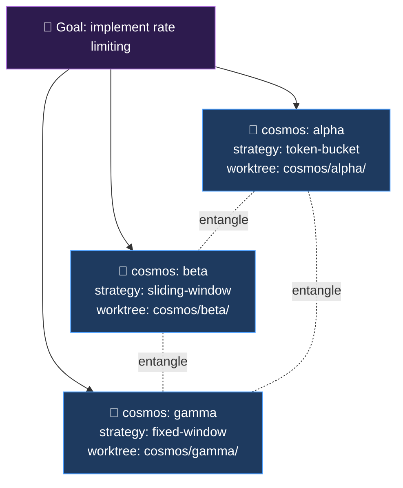
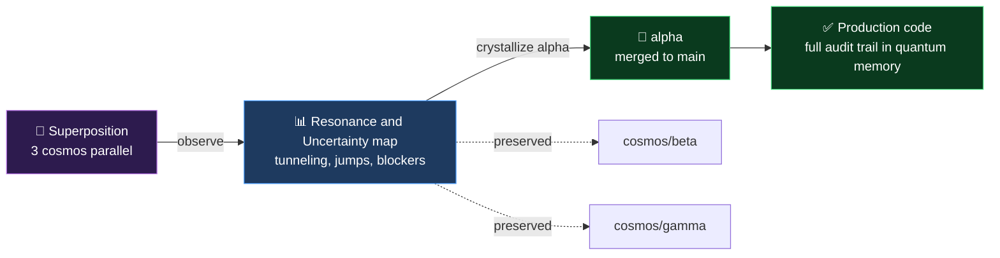

# 🌌 QuantumAgent

[](LICENSE)

> Before you commit to one approach, explore three in parallel.
>
> *Parallel cosmos exploration harness for Claude Code.*

A Claude Code plugin that runs multiple AI agents simultaneously — each tackling
the same goal with a different strategy. Agents share discoveries in real time
through Quantum Memory. When they independently reach the same conclusion, that's
your signal to trust it. When they diverge, that's your actual tradeoff made visible.

```
/cosmos spawn --goal "implement user auth" --strategies "jwt,session,oauth2"
```

---

## Architecture — Git-Native Orchestration

QuantumAgent's design separates **intent** from **execution**:

| Layer | Lives in | Who owns it |
|---|---|---|
| **Control Plane** — goals, plans, memory, signals, review | Git working tree (Markdown + JSONL) | QuantumAgent |
| **Effector Layer** — external APIs, DBs, browsers, code execution | Host agent's native tools / MCP / CLI | The host (Claude Code, Cursor, Aider, ...) |

Everything QuantumAgent persists is a plain file you can `cat`, `grep`, `git diff`, and `git revert`. The host agent owns the side effects. This is what makes the same workflow portable across 10+ environments — there is no proprietary runtime to port.

---

## What you get

A typical 30-minute run produces:

- **4–8 Resonance decisions** you can ship without second-guessing — multiple independent implementations agreed
- **2–4 Uncertainty decisions** made explicit — you now know the real tradeoff and can choose deliberately
- **Working code in N branches** — not a theoretical comparison but actual implementations that found real bugs
- **[TUNNEL] / [JUMP] breakthroughs** — solutions that wouldn't emerge from a single sequential agent

The signal-to-noise is high because the findings come from *doing*, not theorizing. Bugs surface during implementation, not after deployment.

---

## The problem

You're building something with Claude Code. Claude implements one approach. You
ship it. Three weeks later you're refactoring because the architecture didn't scale,
you discover a security edge case, or you realize a different approach would have
been cleaner.

The problem isn't Claude — it's that a single agent exploring a single path cannot
tell you what it didn't explore.

**QuantumAgent runs the exploration before you commit.** Not as a theoretical
comparison — as actual working implementations that discover real issues in real code.

---

## How it works

```
Your goal (pure potential — the wave)
         │
         ▼
 /cosmos spawn --strategies "A,B,C"
         │
    ┌────┴──────────────────────────────────────┐
    │                                           │
    ▼               ▼                           ▼
cosmos:alpha    cosmos:beta               cosmos:gamma
strategy A      strategy B                strategy C
    │               │                           │
    │   reads ◄─────┤──────────────────────► reads
    │               │           ↑               │
    ▼               ▼     .quantum/             ▼
 writes ──────────► * ◄────────────────── writes
    │               │                           │
    └────────────────────────────────────────────┘
         │
         ▼
 /cosmos observe
         │
         ├── ⚡ Resonance  — all strategies independently agreed → ship it
         ├── 🌀 Uncertainty — strategies genuinely diverged → you choose
         ├── ⚛️  Tunneling  — assumed-hard constraint bypassed → examine it
         └── ⚡ Jump        — single insight caused discontinuous leap → trace it
         │
         ▼
 /cosmos crystallize <id>   →   Schrödinger check → merge or keep
 /cosmos stop               →   clean up all worktrees
```

The key: agents don't just share conclusions — they share **discoveries in real time**.
If cosmos:gamma finds a security bug at step 7, cosmos:alpha reads it before step 8
and applies the same fix, all while staying on its own strategy. That's entanglement:
influence without convergence.

---

## 🔭 Visualizing a cosmos run

### 1. Spawn — superposition forms

One goal, multiple parallel cosmos, each in an isolated git worktree:



Each cosmos writes append-only insights to its own `.quantum/<name>/insights.jsonl`.
All cosmos read every other cosmos's insights between major steps. This is the
**entanglement channel** — no shared mutable state, no merge conflicts, just a
broadcast log on disk.

### 2. Observe — read the superposition without collapsing it

`/cosmos:observe` is the non-destructive measurement. It prints the live state of
all cosmos plus the quantum signal map:

```
🌌 Superposition Snapshot
═══════════════════════════════════════════════════════════════════

cosmos:alpha   (token-bucket)    ●●●●●●●●●  9 insights
  └ {"type":"tunnel","content":"Redis sorted sets eliminate the rate-limit table entirely"}
  └ {"type":"decision","content":"Millisecond precision is sufficient for SLA buckets"}

cosmos:beta    (sliding-window)  ●●●●●●●●●● 10 insights
  └ {"type":"jump","content":"Switched to event-sourcing after reading alpha's audit insight"}
  └ {"type":"decision","content":"Millisecond precision is sufficient for SLA buckets"}

cosmos:gamma   (fixed-window)    ●●●●●●     6 insights
  └ {"type":"decision","content":"Millisecond precision is sufficient for SLA buckets"}
  └ {"type":"blocker","content":"Boundary-second double-counting under burst load"}

⚡ Resonance ━━━━━━━━━━━━━━━━━━━━━━━━━━━━━━━━━━━━━━━━━━━━━━━━━━━━━
   "millisecond precision" — 3 cosmos converged → trust this

🌀 Uncertainty ━━━━━━━━━━━━━━━━━━━━━━━━━━━━━━━━━━━━━━━━━━━━━━━━━━
   data structure: sorted-set (alpha) vs ring-buffer (beta) vs hash (gamma)
   → real tradeoff, developer chooses

✨ Tunneling ━━━━━━━━━━━━━━━━━━━━━━━━━━━━━━━━━━━━━━━━━━━━━━━━━━━━━
   alpha: Redis sorted sets replace the separate rate-limit table

⚡ Quantum Jump ━━━━━━━━━━━━━━━━━━━━━━━━━━━━━━━━━━━━━━━━━━━━━━━━━━
   beta ← alpha: switched to event-sourcing mid-implementation

🚧 Unresolved Blockers ━━━━━━━━━━━━━━━━━━━━━━━━━━━━━━━━━━━━━━━━━━━
   gamma: boundary-second double-counting under burst load
```

> The output above is the format defined in [`skills/observe/SKILL.md`](skills/observe/SKILL.md). A real run produces actual content; the structure and signal categories are fixed.

### 3. Crystallize — collapse one cosmos into the deliverable



`/cosmos:crystallize alpha` is the measurement that collapses one cosmos into a
definite result and merges its branch. **Other cosmos remain on their own
branches**, preserved for reference or follow-up crystallization.

### 4. Quantum signals — what to look for

| Signal | Meaning | Action |
|---|---|---|
| ⚡ **Resonance** | N cosmos independently reached the same conclusion | Ship with confidence |
| 🌀 **Uncertainty** | Cosmos diverged on a decision | Real tradeoff — you choose |
| 🔁 **Degeneracy** | Different strategies, identical implementations | Single natural solution exists |
| ⚠️ **Decoherence** | A cosmos lost its strategy by copying another | Flag — not a true sample |
| ✨ **Tunneling** (`type: "tunnel"`) | A cosmos bypassed an assumed hard constraint | Unexpected solution path |
| ⚡ **Quantum Jump** (`type: "jump"`) | A single entanglement read caused a discontinuous shift | Non-obvious architectural leap |
| 🧊 **Bose-Einstein Condensate** | Zero uncertainty + ≥3 resonant decisions + all cosmos participated | The goal was deterministic — ship any cosmos |

### 5. See a real run

---

## 🛰️ Featured run — [`examples/auth-audit/`](examples/auth-audit/)

> **A 3-cosmos security audit of a production Electron + Next.js payment terminal.**
> Run twice. Real source. Verbatim observe output included.

| 3 cosmos | 2 rounds | 5 CRITICALs | 1 [TUNNEL] | 0 fabricated insights |
|:---:|:---:|:---:|:---:|:---:|
| security-threat<br/>code-architecture<br/>offline-resilience | deliberate re-spawn<br/>to test signal stability | including JWT no-exp,<br/>revocation gap, plaintext token | Electron CORS<br/>wildcard injection | every `.jsonl` line<br/>is the agent's actual output |

### What the 1st round found

> ### ⚡ 3-way resonance — *"The token has no expiration, revocation is a no-op against stateless JWT, and the token is stored plaintext. The three reinforce each other."*
>
> All three cosmos arrived at this independently, from three different lenses. **Systemic flaw, not a local bug.** Ship the fix as a single coordinated change.

Plus: `platform_admin` self-registration (OWASP A01), `cancel-request` `body.termId` spoof, cross-tenant IDOR on `/api/terminals`, three coexisting auth schemes with no central dispatcher.

### What the 2nd round added — *the case for re-spawning*

> ### ✨ `[TUNNEL]` — Electron CORS wildcard injection in `electron/main.js`
>
> When a response is missing `Access-Control-Allow-Origin`, the main process **injects `*` plus allows the `Authorization` header**. Any XSS or supply-chain compromise exfiltrates bearer tokens to an attacker-controlled origin.
>
> **The 1st round missed this entirely.** A single re-spawn surfaced it.

Plus: `terminals/[id]/account|key` PUT routes don't verify merchant ownership → cross-tenant **write** path → full account takeover. Another critical the 1st round didn't reach.

### Why this example matters

- **Resonance is real.** Three independent strategies, three different lenses, same conclusion. This is the signal you can't get from a single sub-agent.
- **Re-spawning is not optional.** The most dangerous finding (`[TUNNEL]` CORS injection) only surfaced on round 2. For high-stakes goals, run cosmos twice.
- **No theater.** The full verbatim auto-observe output, raw `.jsonl` insights, and spawn command are in the repo. Read [`observe-snapshot.md`](examples/auth-audit/observe-snapshot.md) and decide for yourself.

→ **[Read the full audit](examples/auth-audit/)** · [insights/alpha.jsonl](examples/auth-audit/insights/alpha.jsonl) · [insights/beta.jsonl](examples/auth-audit/insights/beta.jsonl) · [insights/gamma.jsonl](examples/auth-audit/insights/gamma.jsonl)

---

Other real cosmos run outputs (spawn command + raw `.quantum/*.jsonl` + observe + crystallize) are collected in [`examples/`](examples/). We deliberately don't ship fabricated examples — only sessions a developer actually ran on real code. If you've done a meaningful cosmos run, [contribute it](examples/README.md#contributing-a-run).

---

## Install

QuantumAgent ships as a self-marketplace Claude Code plugin. Inside Claude Code:

```
/plugin marketplace add hyuniiiv/quantum-agent
/plugin install cosmos@quantum-agent
/reload-plugins
```

After install, the `/cosmos` slash commands are available immediately.

No Python. No vector database. No subprocess. Pure markdown skills.
Quantum Memory is plain JSON Lines files on disk.

### Use in other AI agents

QuantumAgent's core is platform-neutral markdown. The same workflows run in **any AI coding agent** that accepts custom instructions or rules files:

| Environment | Mechanism |
|---|---|
| Claude Code | Native plugin (above) |
| Claude Desktop / claude.ai | Custom Instructions |
| Cursor | `.cursor/rules/cosmos.mdc` |
| Windsurf | `.windsurfrules` |
| Cline / Roo Code | Custom Instructions |
| Continue.dev | `config.json` system message |
| Aider | `CONVENTIONS.md` via `--read` |
| OpenAI Codex CLI | `--prompt-file` |
| Gemini CLI | `GEMINI.md` |
| GitHub Copilot | `.github/copilot-instructions.md` |
| Zed AI | Assistant custom prompt |
| OpenCode (sst) | `AGENTS.md` |
| Crush (Charm) | `AGENTS.md` / `CRUSH.md` |
| OpenHands | `.openhands/microagents/cosmos.md` |
| Goose (Block) | `.goosehints` |
| OpenClaw | `~/.openclaw/skills/cosmos-*/SKILL.md` (AgentSkills format) |
| Hermes Agent (Nous Research) | `~/.hermes/skills/cosmos-*/SKILL.md` (AgentSkills format) |
| Any AGENTS.md-aware agent | `AGENTS.md` |
| Any agentskills.io-compatible agent | Drop `skills/*` into the agent's skills directory |

The same `.quantum/` memory works across agents — spawn in Cursor, observe in Claude Code, crystallize in Aider. See **[INTEGRATIONS.md](INTEGRATIONS.md)** for per-platform setup and the universal **[`bundle/cosmos-instructions.md`](bundle/cosmos-instructions.md)** drop-in file.

### Troubleshooting

**`git@github.com: Permission denied (publickey)` during install**

Claude Code clones the plugin over SSH by default. If you don't have a GitHub SSH key set up, rewrite SSH URLs to HTTPS for github.com:

```bash
git config --global url."https://github.com/".insteadOf git@github.com:
```

Then retry `/plugin install quantum-agent@quantum-agent`.

Alternatives:
- `gh auth login` → `gh auth setup-git` (uses HTTPS + credential helper)
- Add an SSH key: `ssh-keygen -t ed25519 -C "you@example.com"` and register the public key in GitHub → Settings → SSH Keys

---

## Quick start

```
/cosmos spawn --goal "implement rate limiting middleware" --strategies "token-bucket,sliding-window,fixed-window"
```

Three cosmos start in parallel. Each builds a working implementation.
Each reads the others' insights between every major step.

```
/cosmos observe
```

```
🌌 cosmos:alpha  (8 insights)  — token-bucket
   └ Redis HINCRBY for atomic counter update — avoids race condition under concurrent load
   └ Burst allowance: 2× rate for first 3s of a new window — documented as intentional

🌌 cosmos:beta   (7 insights)  — sliding-window
   └ Sliding log stored as Redis sorted set (score = timestamp)
   └ ZREMRANGEBYSCORE + ZCARD in a pipeline — single round trip regardless of log size

🌌 cosmos:gamma  (9 insights)  — fixed-window
   └ Fixed window boundary edge case: 2× burst possible — documented, not patched (by design)
   └ INCR + EXPIRE in Lua script for atomicity — prevents TOCTOU between the two operations

⚡ Resonance — trust these (all 3 strategies converged):
   "Redis Lua script or pipeline for atomicity" — all 3 cosmos found this independently
   "429 Too Many Requests + Retry-After header" — all 3 cosmos converged on this
   "X-RateLimit-Limit, X-RateLimit-Remaining, X-RateLimit-Reset headers" — 3/3 agree

🌀 Uncertainty — your call (strategies genuinely diverged):
   "burst handling"   — alpha: explicit 2× burst allowance  |  gamma: documented edge case only
   "memory per user"  — beta: O(requests) sliding log        |  alpha/gamma: O(1) counter

🔬 Non-destructive observation — superposition intact.
   Run /cosmos crystallize <id> to collapse a cosmos into a definite result.
```

Pick the result you want:

```
/cosmos crystallize beta    # extract beta — Schrödinger check, then optional merge
/cosmos stop                # clean up all worktrees and branches
```

---

## Full walkthrough: JWT authentication

A real run. Three strategies, 30 insights, one critical security bug caught.

### Spawn

```
/cosmos spawn --goal "implement JWT user authentication" \
  --strategies "jwt-stateless,rs256-keyrotation,hs256-refresh"
```

```
🌌 Spawning 3 cosmos...

  [alpha] cosmos/alpha  strategy: jwt-stateless
  [beta]  cosmos/beta   strategy: rs256-keyrotation
  [gamma] cosmos/gamma  strategy: hs256-refresh

⚛️  Quantum Memory: .quantum/

Agents running. Superposition snapshot when complete.
```

### Observe

```
🌌 cosmos:alpha  (10 insights)  — jwt-stateless
   └ JWT payload sub+email only; algorithms: [HS256] explicit — blocks algorithm confusion attacks
   └ User enumeration: dummy bcrypt.compare even on unknown users — constant ~250ms response time

🌌 cosmos:beta   (9 insights)   — rs256-keyrotation
   └ RS256 2048-bit over 4096-bit: doubles signing latency for negligible gain on 15-min tokens
   └ kid header = SHA-256(public key, first 16 hex) — key rotation without DB migration

🌌 cosmos:gamma  (11 insights)  — hs256-refresh
   └ Refresh token family revocation: stolen token detected → entire family invalidated immediately
   └ [BUG] Dummy hash was malformed literal — bcrypt.compare threw in <1ms, defeating anti-enumeration

⚡ Resonance — trust these (all 3 strategies converged):
   "15-minute access token expiry" — all 3 cosmos independently arrived here
   "{ error: { code: string, message: string } } response envelope" — all 3 converged
   "TOKEN_EXPIRED as distinct code from INVALID_TOKEN" — all 3 cosmos adopted this
   "constant-time bcrypt path even for unknown users (anti-enumeration)" — all 3 independently built this

🌀 Uncertainty — your call (strategies genuinely diverged):
   "signing algorithm"  — alpha/gamma: HS256 (simpler, single-server)  |  beta: RS256 (key rotation ready)
   "bcrypt cost factor" — alpha/gamma: rounds=12 (~250ms, security-first) |  beta: rounds=10 (NIST baseline, ~100ms)
   "refresh tokens"     — gamma: 7-day refresh + family revocation         |  alpha/beta: stateless only

🔬 Non-destructive observation — superposition intact.
   Run /cosmos crystallize <id> to collapse a cosmos into a definite result.
```

### What this tells you

**Ship these without debate** — Resonance confirmed all four:

| Decision | Why trust it |
|----------|-------------|
| 15-minute access tokens | jwt-stateless, rs256-keyrotation, and hs256-refresh all landed here independently via different reasoning |
| `{ error: { code, message } }` format | Identical shape across all three cosmos — zero negotiation needed |
| `TOKEN_EXPIRED` ≠ `INVALID_TOKEN` | Client-side UX depends on this distinction — all cosmos independently recognized this |
| Constant-time login for unknown users | All three implemented it — and gamma found a real bug others missed |

**Make a conscious call on each Uncertainty:**

- **Algorithm** — Single server or internal API only? HS256. Multiple independent services need to verify tokens, or key rotation is a near-term requirement? RS256.
- **bcrypt rounds** — Low-spec deployment hardware or demo usability matters? rounds=10. Production security-first? rounds=12. Both are correct; pick based on your constraints.
- **Refresh tokens** — User-facing app where session persistence matters? Gamma's 7-day refresh with family revocation. Internal API where simplicity beats UX? Stateless.

**The critical catch:** cosmos:gamma discovered that the standard dummy-hash anti-enumeration pattern was *silently broken* — a malformed literal string caused bcrypt to throw immediately in under 1ms, completely defeating the timing protection. This is the class of bug that shows up in security audits eighteen months after shipping. All three cosmos had the same vulnerable pattern; gamma caught it during smoke testing.

Without QuantumAgent: three separate implementations, each written once, none cross-reviewed. The bug ships.

### Crystallize

```
/cosmos crystallize gamma
```

```
💎 cosmos:gamma — Crystallization
════════════════════════════════════════

Strategy: hs256-refresh
Insights: 11
Branch: cosmos/gamma

Core Decisions:
  1. Two separate JWT secrets (JWT_ACCESS_SECRET / JWT_REFRESH_SECRET) — cross-type
     token confusion impossible even if type claim check were bypassed
  2. Refresh token rotation with familyId (UUID per login) — token reuse triggers
     full family revocation, which is the correct threat model for token theft
  3. Token store keyed by jti (UUID), not raw token string — O(1) lookup, no
     timing-sensitive string comparison
  4. bcrypt rounds=12 + precomputed DUMMY_HASH at module load — constant ~250ms
     for all login paths including unknown emails (verified: 227ms in smoke test)

Trade-offs Rejected:
  - RS256 → rejected: key-pair management overhead unjustified for single-server deployment
  - Single JWT secret → rejected: allows refresh tokens to be used as access tokens
  - Inline dummy hash literal → rejected: bcrypt.compare throws immediately on malformed input

Resonance Adopted (from other cosmos via entanglement):
  - TOKEN_EXPIRED distinct from INVALID_TOKEN (adopted from alpha's insight)
  - { error: { code, message } } shape (confirmed by all cosmos — zero divergence)

Quantum Tunneling: none
Quantum Jumps: none

Final Answer:
  Full JWT auth with access tokens (15min HS256) + refresh tokens (7-day) with
  family-based revocation. Constant-time login path verified at 227ms for unknown
  emails. Helmet middleware for HTTP security headers. 9/9 smoke tests pass,
  including token reuse attack and sibling family revocation scenarios.

🐱 Schrödinger's Cat collapses on crystallization — quality is now definite, not potential.
   Have you run your test suite against cosmos/gamma?

   - yes, tests pass — proceed to merge
   - yes, tests failed — do not merge; fix in the cosmos branch, then re-crystallize
   - no, not yet — run tests first; come back when ready
```

---

## Commands

### `/cosmos spawn`

```
/cosmos spawn --goal "<goal>" --strategies "<s1,s2,...>" [--entanglement <mode>]
```

Launches one cosmos per strategy. Names assigned alphabetically: `alpha`, `beta`,
`gamma`, `delta`, `epsilon` (max 5). Each cosmos gets:

- An isolated git worktree at `cosmos/<name>`
- A dedicated branch `cosmos/<name>`
- A quantum memory file `.quantum/<name>/insights.jsonl`
- A `CLAUDE.md` with goal, strategy, entanglement rules, and quantum tag instructions
- Auto-injected **project spin** and **active singularities** (if defined — see Macro-scale section)

**Pauli Exclusion check:** Duplicate strategies are rejected immediately.

```
❌ Pauli Exclusion violated: "jwt" appears more than once.
   No two cosmos can occupy the same state. Each strategy must be distinct.
```

Agents run in parallel. When all finish, `/cosmos observe` runs automatically.

| Flag | Description |
|------|-------------|
| `--goal` | The task every cosmos works toward |
| `--strategies` | Comma-separated list — one cosmos per strategy |
| `--entanglement` | `none` / `passive` *(default)* / `active` — see below |

**Entanglement modes** *(v1.2, extended in v1.3)*:

| Mode | Behavior | When to use |
|------|---------|-------------|
| `none` | Cosmos do NOT read other cosmos insights. Pure independent exploration. | When you want true independence — agentic A/B testing, statistical sampling |
| `passive` *(default)* | Cosmos read other insights between major implementation steps. | Default — most architecture/implementation tasks |
| `active` | Cosmos read AND must record `read_from: cosmos:<source>` when adopting another's pattern. | When traceability matters — security audit, compliance, debugging |
| `strict` *(v1.3)* | Heartbeat protocol — each cosmos publishes `heartbeat` per step AND must write `heartbeat-ack` for every unACK'd heartbeat from others before its next step. Verifiable live entanglement. | When you need *proof* of live agent communication — race condition debugging, distributed system design, compliance audits |

---

### `/cosmos observe`

Reads all `.quantum/*/insights.jsonl` and outputs:

- Superposition snapshot (latest 2 insights per cosmos)
- **Resonance map** — decisions every strategy independently converged on
- **Uncertainty map** — decisions where strategies genuinely diverged
- **Degeneracy** — if different strategies reached functionally identical implementations
- **[TUNNEL] report** — constraints that were bypassed
- **[JUMP] report** — discontinuous architectural leaps
- **Decoherence warning** — if a cosmos lost its strategic identity
- **BEC** — if all cosmos converged on all decisions with zero uncertainty

Non-destructive: superposition stays intact. Run as many times as you want while agents work.

---

### `/cosmos crystallize <id>`

Collapses one cosmos into a standalone result:

1. Reads insights — identifies core decisions, rejected alternatives, Resonance adopted, [TUNNEL] / [JUMP] events
2. Shows last 10 commits and diff stats from the worktree branch
3. **Schrödinger check** — forces confirmation that tests pass before offering merge
4. Offers to merge (`git merge cosmos/<id> --no-ff`) or preserve the branch

Other cosmos are unaffected. Superposition holds for remaining cosmos until `/cosmos stop`.

---

### `/cosmos stop`

Removes all cosmos worktrees and branches. Offers to wipe `.quantum/`
(insights are preserved by default — you may want them for retrospectives).

---

### `/cosmos spin` *(new in v1.3)*

```
/cosmos spin --name "<name>" [--type "<type>"] [--description "<text>"] [--constraints "<c1,c2,c3>"]
/cosmos spin                                        # display current spin (no args)
```

Declares or updates the **project's immutable identity** — its quantum spin. Once declared, every `/cosmos spawn` automatically inherits the spin as invariant constraints. A strategy that violates the spin isn't exploring the goal; it's exploring a different problem.

```bash
/cosmos spin \
  --name "QuantumAgent" \
  --type "claude-code-plugin" \
  --description "Parallel cosmos exploration harness" \
  --constraints "no external runtime dependencies,git-native control plane,claude code compatible"
```

Output:

```
✨ Project spin declared

   Name:        QuantumAgent
   Type:        claude-code-plugin
   Description: Parallel cosmos exploration harness

   Immutable constraints (3):
     • no external runtime dependencies
     • git-native control plane
     • claude code compatible

🌌 All future /cosmos spawn calls will inherit this spin as invariant context.
```

`established` is set once on first declaration and preserved on updates. `updated` reflects each change. To declare a paradigm shift instead, use `/cosmos singularity`.

See [Multi-scale: the macro layer](#multi-scale-the-macro-layer) for the full mental model.

---

### `/cosmos run` *(new in v2.0)*

```
/cosmos run <path-to-yaml>
```

Executes a **declarative quantum experiment** from a YAML file. Quantum exploration as code — version-controlled, reproducible, CI/CD-ready.

```bash
/cosmos run experiments/rate-limiting.qa.yaml
```

The YAML can declare project spin, singularities, and the spawn configuration in a single file:

```yaml
experiment: rate-limiting-design
version: 1

spin:                                   # optional — apply project identity
  name: my-api
  constraints: [redis-only, p99-under-50ms]

singularities:                          # optional — declare macro events
  - name: api-v2-migration
    invalidates: [v1-routes]

spawn:                                  # required — the exploration itself
  goal: "rate limiting middleware"
  strategies: [token-bucket, sliding-window, fixed-window]
  entanglement: passive
```

Execution order: validate → apply spin → apply singularities → spawn (with provenance tagged into every cosmos's first insight) → auto-observe on completion.

See [`experiments/_template.qa.yaml`](experiments/_template.qa.yaml) for the annotated template and [`experiments/rate-limiting.example.qa.yaml`](experiments/rate-limiting.example.qa.yaml) for a runnable example.

**Why declarative?** Same YAML = same configuration, always. Experiments become reviewable in pull requests. Quarterly audits run on cron. The exploration outputs still depend on agent runs, but the *design* is fixed and traceable.

See [Declarative experiments — the YAML DSL](#declarative-experiments--the-yaml-dsl) for the full mental model and CI/CD integration.

---

### `/cosmos singularity` *(new in v1.2)*

```
/cosmos singularity --name "<event>" --invalidates "<patterns>" [--trigger "<reason>"] [--description "<text>"]
```

Declares a **macro-scale event** that reshapes project context. Singularities are project-level events (migrations, paradigm shifts, compliance changes) that:

- Are appended to `.quantum/singularities/events.jsonl` (append-only, audit-grade)
- Are automatically loaded as context by every future `/cosmos spawn`
- Mark a "current era" — patterns matching `invalidates` from before the singularity are treated as stale

Example:

```
/cosmos singularity --name "auth-migration-v2" \
  --trigger "compliance-2026-Q3" \
  --invalidates "session-based-auth,pre-2026-cookie-policy" \
  --description "All session-based auth retired. JWT-only going forward."
```

Output:

```
☄️  Singularity declared

   Name:        auth-migration-v2
   Timestamp:   2026-05-12T14:32:00Z
   Trigger:     compliance-2026-Q3
   Invalidates: session-based-auth, pre-2026-cookie-policy

🌌 All future /cosmos spawn calls will inherit this singularity as macro context.
   Insights matching invalidated patterns will be treated as pre-singularity (stale).
```

See [Multi-scale: the macro layer](#multi-scale-the-macro-layer) for the full mental model.

---

## Multi-scale: the macro layer *(new in v1.2)*

QuantumAgent operates at three scales:

```
🌌 Cosmos scale  — /cosmos spawn (N parallel strategies)
🌍 Project scale — /cosmos singularity + .quantum/project/spin.json  ← v1.2
⚛️  Code scale    — (v2.0 roadmap)
```

The macro layer adds two files that every spawn reads automatically:

### Project Spin — `.quantum/project/spin.json`

The project's **immutable identity**. Optional but recommended for any project past prototyping.

```json
{
  "name": "QuantumAgent",
  "type": "claude-code-plugin",
  "description": "Parallel cosmos exploration harness",
  "immutable_constraints": [
    "no external runtime dependencies",
    "git-native control plane",
    "claude code compatible"
  ],
  "established": "2026-05-11T00:00:00Z"
}
```

When defined, every cosmos automatically inherits these as **invariant constraints** — a strategy that violates a spin constraint isn't exploring the goal, it's exploring a different problem.

### Singularities — `.quantum/singularities/events.jsonl`

**Project-level quantum events** — append-only log of phase transitions:

```json
{"name":"auth-migration-v2","ts":"2026-05-12T14:32:00Z","trigger":"compliance-2026-Q3","invalidates":["session-based-auth"],"description":"..."}
{"name":"framework-upgrade-next15","ts":"2026-06-01T09:00:00Z","trigger":"performance","invalidates":["pages-router"],"description":"..."}
```

Each singularity:
- Defines a **current era** — everything before the most recent singularity may be stale
- Auto-injects into every future cosmos via spawn
- Is **append-only** — audit-grade history, never edited

### Why this matters in agentic environments

Without macro context, every `/cosmos spawn` starts from the same baseline. An audit cosmos exploring authentication today would weigh 6-month-old insights about cookie-based sessions equally with current JWT-only practice. **Singularities establish temporal coherence across agentic runs** — cosmos know which era they're in without manual context-pasting.

This is the General Relativity analog: constraints curve the solution space, and singularities mark phase transitions in that curvature.

---

## Micro scale — `/cosmos scan` *(new in v4.0)*

The third and final scale of QuantumAgent's multi-scale architecture: **code-level quantum phenomena**. While `/cosmos spawn` operates at the cosmos scale (parallel implementations) and `/cosmos singularity` at the project scale (macro events), `/cosmos scan` operates at the function/file/symbol scale.

```bash
/cosmos scan [--paths "src/,lib/"] [--languages "ts,py"] [--include-tests] [--git-churn-threshold 50]
```

Four detection types:

| Type | Quantum analog | What it detects |
|------|---------------|----------------|
| **`code-tunnel`** | Particle bypasses classically-forbidden barrier | Type-system bypass: `as unknown as`, `@ts-ignore`, `# type: ignore`, `eval`, dynamic property assignment, `unsafe`, `transmute` |
| **`code-decoherence`** | Phase information lost to environment | Source file with no corresponding test — state never "observed" via tests |
| **`code-superposition`** | System exists in multiple states simultaneously | Feature flags + A/B branches: code runs in multiple states selected by environment |
| **`code-jump`** *(optional)* | Discontinuous energy-level transition | High recent git churn — file recently restructured beyond a threshold |

Findings append to `.quantum/code/findings.jsonl`:

```json
{"type":"code-tunnel","subtype":"as-unknown-as","file":"src/auth.ts","line":42,"evidence":"as unknown as User","ts":"..."}
{"type":"code-decoherence","file":"src/payment.ts","reason":"no test file found","ts":"..."}
{"type":"code-superposition","subtype":"env-feature-flag","file":"src/router.ts","line":15,"evidence":"if (process.env.FEATURE_NEW_UI)","ts":"..."}
{"type":"code-jump","file":"src/store.ts","churn_lines":230,"window":"last-10-commits","ts":"..."}
```

`/cosmos observe` (v4.0+) automatically surfaces these in a new code-scale section, including **cross-scale signals** — when a cosmos modified a file that has a code-scale finding, that's a candidate for crystallize review.

The Python `from_cosmos()` interop (v3.3+) now also exposes `CosmosRun.code_findings` and `code_summary()` — all four scales accessible as Python data in one call.

### 4-scale architecture — the original vision complete

```
🌌 Cosmos scale   (v1.x) — /cosmos spawn — N parallel implementations
🌍 Project scale  (v1.2) — /cosmos spin + /cosmos singularity — macro context
⚛️  Code scale    (v4.0) — /cosmos scan — function/file/symbol quantum state
🧮 Math layer     (v3.x) — Python primitives — canonical quantum mechanics
```

The Layer 1 (CLI) × 4 scales matrix is now complete. Layer 2 (YAML DSL) and Layer 3 (Python primitives) extend across the scales additively.

---

## Declarative experiments — the YAML DSL *(new in v2.0)*

QuantumAgent v2.0 adds a **declarative layer** on top of the CLI. Experiments become YAML files — version-controlled, reviewable, re-executable.

### The shift — imperative vs declarative

```bash
# v1.x — imperative (commands invoked one at a time)
/cosmos spin --name "..." --constraints "..."
/cosmos singularity --name "..." --invalidates "..."
/cosmos spawn --goal "..." --strategies "..." --entanglement passive
```

```yaml
# v2.0 — declarative (one YAML, one command)
experiment: rate-limiting-design
version: 1

spin:
  name: my-api
  constraints: [redis-only, p99-under-50ms]

singularities:
  - name: api-v2-migration
    invalidates: [v1-routes]

spawn:
  goal: "rate limiting middleware"
  strategies: [token-bucket, sliding-window, fixed-window]
  entanglement: passive
```

```bash
/cosmos run experiments/rate-limiting.qa.yaml
```

### Why this matters

**Reproducibility** — Same YAML = same configuration. Agent outputs vary (that's the point), but the *experiment design* is fixed and version-controlled.

**Review** — Experiment files can be reviewed in pull requests. "Why are we testing these three strategies?" becomes a documented decision in git, not a Slack thread.

**Re-execution** — `/cosmos run experiments/security-audit.qa.yaml` always means the same thing. Useful for periodic explorations.

**CI/CD-grade** — Quantum experiments can run on a schedule, in response to triggers, or as part of release gates:

```yaml
# .github/workflows/quarterly-audit.yml (sketch)
on:
  schedule:
    - cron: '0 0 1 */3 *'   # first day of each quarter
steps:
  - uses: actions/checkout@v4
  - run: claude /cosmos run experiments/security-audit.qa.yaml
  - uses: actions/upload-artifact@v4
    with:
      name: quantum-memory-${{ github.run_id }}
      path: .quantum/
```

**Provenance** — Every cosmos's first insight in a `/cosmos run` is a `type: "run"` entry citing the experiment file and schema version. Auditors can answer "which experiment produced this insight?" by reading the first line of any insights.jsonl.

### YAML schema (v1)

The full schema, validation rules, and execution flow are documented in [`skills/run/SKILL.md`](skills/run/SKILL.md). Annotated template at [`experiments/_template.qa.yaml`](experiments/_template.qa.yaml).

### When to use `/cosmos run` vs `/cosmos spawn`

| Use `/cosmos spawn` | Use `/cosmos run` |
|---------------------|-------------------|
| Quick one-off exploration | The experiment will be repeated |
| Strategies are still being chosen | Strategies are stable |
| You're prototyping the question | The question is well-defined |
| No need for audit trail beyond `.quantum/` | Provenance ("which experiment produced this?") matters |

Both call the same underlying spawn logic — `/cosmos run` is `/cosmos spawn` with a declarative façade and macro-layer integration.

---

## Python primitives — Layer 3 *(new in v3.0)*

QuantumAgent v3.0 adds a **programmable layer**: a Python package that exposes the underlying quantum decision primitives directly in code. Layer 1 (CLI) and Layer 2 (YAML DSL) orchestrate AI agents; Layer 3 exposes the math that conceptually underlies them.

```python
from quantumagent import psi, entangle, observe, measure, constraint

cache = psi(["redis-ttl", "cdn-edge", "in-memory-lru"], weights=[0.5, 0.3, 0.2])
storage = psi(["postgres", "redis", "memory"])

entangle(cache, storage, lambda c, s:
    (c == "redis-ttl"     and s == "redis") or
    (c == "cdn-edge"      and s == "postgres") or
    (c == "in-memory-lru" and s == "memory")
)

cache = constraint("low-latency", boost={"redis-ttl": 2.0}) @ cache

print(observe(cache))           # {'redis-ttl': 0.667, 'cdn-edge': 0.200, ...}  — non-destructive
final = measure(cache)          # collapses to one state via Born-rule sampling
                                # storage's distribution is automatically conditioned
```

### Three layers, one philosophy

```
Layer 1 (v1.x) — CLI                 Layer 2 (v2.0) — YAML DSL          Layer 3 (v3.0) — Python
────────────────────────             ─────────────────────────          ────────────────────────
/cosmos spawn --goal "..."           experiment: my-exp                 cache = psi(...)
/cosmos observe                      spawn:                             entangle(cache, store, ...)
/cosmos crystallize alpha              goal: "..."                      constraint("...") @ cache
                                       strategies: [...]                measure(cache)
                                     /cosmos run my-exp.qa.yaml

Backend: LLM agents in worktrees     Backend: same agents via YAML      Backend: pure math
                                                                        (LLM integration: future)
```

### Install

```bash
pip install -e python/    # from this repo
```

Python 3.9+. No runtime dependencies — pure stdlib.

### The five primitives

| Primitive | Purpose |
|-----------|---------|
| `psi(states, weights)` | Declare a decision as a probability distribution (aka `ψ`) |
| `observe(psi)` | Read distribution without collapsing — non-destructive |
| `measure(psi, seed=None)` | Collapse to one state via Born-rule sampling — irreversible |
| `entangle(a, b, correlation)` | Link two decisions so measurement of one conditions the other |
| `constraint(name, boost=…, suppress=…, where=…) @ psi` | Apply an operator that curves the distribution |

### Two modes — classical and quantum *(v3.1 — Path B Phase 1)*

The library now supports **both classical probability distributions and true quantum amplitudes**. Mode is auto-detected from `psi()` arguments:

```python
classical = psi(["A", "B"], weights=[0.6, 0.4])           # real probabilities
quantum   = psi(["A", "B"], amplitudes=[1, -1])           # complex amplitudes (|-⟩ state)
```

Quantum mode (v3.1+) unlocks:

- **True Born rule** — `P(i) = |amplitude_i|²`
- **Real interference** — `superpose(a, b)` ADDS amplitudes (not probabilities). Phase matters.
- **Maximal entanglement** — `bell_state("phi+"|"phi-"|"psi+"|"psi-")` constructs 2-qubit Bell states.

```python
from quantumagent import psi, superpose, bell_state, measure, observe

# Two equal sources, OPPOSITE phase
slit_a = psi(["screen-A", "screen-B"], amplitudes=[1,  1])
slit_b = psi(["screen-A", "screen-B"], amplitudes=[1, -1])
mixed = superpose(slit_a, slit_b)
print(observe(mixed))    # → {'screen-A': 1.0, 'screen-B': 0.0}
                         # DESTRUCTIVE INTERFERENCE — classical impossible.

# Maximally-entangled 2-qubit pair
bell = bell_state("phi+")
# 2000 measurements → always ('0','0') or ('1','1'), never mixed.
# Perfect correlation, despite each qubit alone looking 50/50.
```

See `python/examples/04_quantum_interference.py` and `05_bell_state.py` for the full demonstrations — both verified producing the theoretically-predicted outcomes (1000:0 on destructive interference, 2000:0:0:2000 split on Bell state).

### Path B status — **complete (v3.2)**

| Phase | Status | Features |
|-------|--------|----------|
| Phase 1 (v3.1) | ✓ Shipped | complex amplitudes, interference, Bell states |
| Phase 2 (v3.2) | ✓ Shipped | CHSH inequality test, multi-basis measurement |
| Phase 3 (v3.2) | ✓ Shipped | full quantum gate library (Pauli, Hadamard, CNOT, CZ, SWAP, Rx/Ry/Rz), circuit composition |
| Phase 4 (v3.2) | ✓ Shipped | density matrices, decoherence model, partial trace |

The library now implements canonical quantum mechanics end-to-end. Three decisive empirical demonstrations live in `python/examples/`:

- **`06_chsh_test.py`** — Bell state achieves S ≈ 2.83 (Tsirelson bound), violating the classical |S| ≤ 2 bound. No classical local-realistic theory produces this.
- **`07_quantum_gates.py`** — |00⟩ → H₀ → CNOT(0→1) constructs |Φ+⟩ exactly, matching hardcoded `bell_state("phi+")`. Inverse circuit recovers |00⟩.
- **`08_decoherence.py`** — partial trace of Bell state gives the maximally mixed state I/2 (purity = 0.5), the strongest possible entanglement signature.

The forward-compatible API design means existing v3.0 classical-mode code continues to work unchanged. Quantum mode is purely additive — opt in by passing `amplitudes=` instead of `weights=`.

See [`python/README.md`](python/README.md) for the full guide, eight runnable examples (3 classical + 5 quantum across all four phases), and primitive reference.

---

## Reading the signals

### ⚡ Resonance

Multiple cosmos independently reached the same conclusion.

**What to do:** Ship it without debate. The interference pattern is constructive — multiple
paths through the solution space all arrived here. This is the point of the system.

**Strength signal:** All N cosmos participated, and they arrived via genuinely different
paths (different libraries, different reasoning chains, different constraints). A 3/3
Resonance is much stronger than 2/3.

**When to be skeptical:** Resonance on trivial decisions ("use a try/catch", "validate
inputs") is noise. Resonance on decisions with long-lived architectural consequences
(token expiry strategy, error format contract, consistency model) is the signal you're
paying for.

---

### 🌀 Uncertainty

Strategies reached genuinely different conclusions.

**What to do:** Make a conscious choice — not a random one. You now know the exact
tradeoff: alpha chose HS256 for operational simplicity, beta chose RS256 for
future key rotation. Read both positions and pick based on your actual constraints.

**This is not a failure state.** Uncertainty is valuable output. A problem with zero
Uncertainty either has a deterministic answer (BEC) or your strategies weren't distinct
enough. Real architectural decisions almost always have genuine Uncertainty.

**How to use it:** For each Uncertainty item, ask: "Which cosmos's constraints match
my actual deployment context?" That's your answer.

---

### ⚛️ Quantum Tunneling `[TUNNEL]`

A cosmos bypassed a constraint you assumed was hard — going through the wall
instead of over it.

**What to do:** Read it carefully even if you're not crystallizing that cosmos.
Tunneling insights often look like "we don't need X at all" — eliminating an assumed
requirement rather than implementing it more cleverly.

**Example:** `[TUNNEL] Redis sorted sets eliminate the need for a separate rate-limit
table entirely` — the table you were about to design just isn't necessary.

---

### ⚡ Quantum Jump `[JUMP]`

A cosmos read another's insight and made a discontinuous architectural shift —
not a gradual adaptation but a sudden leap to a qualitatively different solution.

**What to do:** Trace the jump. Find which insight triggered it and what changed.
Jumps often contain the most non-obvious solutions in the run — the kind that require
reading someone else's constraint to realize your own assumed constraint doesn't exist.

---

### ♊ Degeneracy

Different strategies produced functionally identical implementations.

**What to do:** Pick any cosmos — the problem has a single natural solution. The
constraints are strong enough that all strategies converged on the same design.

**Distinction from Resonance:** Resonance = same conclusion reached independently.
Degeneracy = same *implementation* despite different strategies. Degeneracy is the
stronger signal.

---

### 🌡️ Bose-Einstein Condensate

Complete convergence: ≥3 resonant decisions, zero uncertainty, all cosmos
participated in every resonance item.

**What to do:** The goal was deterministic — the constraints left only one answer.
Crystallize any cosmos; they're equivalent. The problem had a right answer all along.

**When it fires:** Rare. Strongly constrained problems where hard requirements
(strict compliance, hard performance ceiling, immovable API contract) eliminate
all architectural freedom. High BEC rate on a domain means it's a mature, well-solved space.

---

### ⚠️ Decoherence

A cosmos abandoned its strategy and copied another wholesale.

**What to do:** Treat it as a compromised sample. Its insights are still readable,
but it's no longer an independent data point. Resonance/Uncertainty analysis
becomes less reliable when a decoherent cosmos is included.

**How it happens:** An agent reads another cosmos's implementation and reconstructs
it wholesale instead of adapting the pattern through its own strategic lens.
Healthy entanglement = "I adopted the Redis pipeline optimization into my sliding-window
implementation." Decoherence = "I switched to token-bucket after reading alpha."

The Spin Preservation rule in each cosmos's `CLAUDE.md` is designed to prevent this.
`/cosmos observe` will flag it if it happens.

---

## Designing good strategies

Strategies are the slits in Young's double-slit experiment. Their job is to force
genuinely different paths through the same solution space. Poor strategies produce
trivial Resonance and absent Uncertainty — the system runs but learns nothing.

### Stay at the same level of abstraction

```
✅ Good: "token-bucket,sliding-window,fixed-window"   (all: rate limiting algorithms)
✅ Good: "jwt-stateless,session-redis,oauth2-pkce"    (all: auth mechanisms)
❌ Bad:  "add-caching,refactor-database,jwt"          (mixed levels: optimization + schema + auth)
```

### Make strategies genuinely mutually exclusive

**The test:** Would a competent engineer implementing strategy A naturally arrive at
strategy B as a byproduct? If yes, they're not distinct enough.

```
✅ Distinct: "jwt"        vs "session"               (fundamentally different statefulness model)
✅ Distinct: "rest"       vs "graphql"               (different query paradigm)
✅ Distinct: "relational" vs "document"              (different data model)
❌ Too close: "jwt-hs256" vs "jwt-rs256"             (same mechanism, one implementation detail)
❌ Too close: "postgres"  vs "postgres-partitioned"  (same database, one feature flag)
❌ Too close: "redis-ttl" vs "redis-sliding-window"  (both Redis; strategy is the algorithm, not the store)
```

### Cover the real axes of the decision

Map the decision space first. What are the independent dimensions that actually matter?
Write strategies that each explore a different axis.

```
Goal: "cache expensive computation"
Axes: where the cache lives, invalidation strategy, storage backend

Better strategies:
  "client-side-etag"         (browser cache + conditional HTTP requests)
  "server-redis-ttl"         (server cache + time-based expiry)
  "server-content-hash"      (server cache + content-fingerprint invalidation)
```

### Two cosmos is usually enough

Start with 2. Add a third only if the first pair diverges interestingly and a
third perspective would add information a tiebreaker or new axis would bring.

```
# Default — covers most architecture decisions
/cosmos spawn --goal "..." --strategies "approach-a,approach-b"

# Add gamma only after observing significant Uncertainty between alpha and beta
/cosmos spawn --goal "..." --strategies "approach-a,approach-b,approach-c"
```

A third cosmos that agrees with one of the first two strengthens Resonance but
doesn't expand Uncertainty. Add it only when you need that confidence, not by default.

---

## Writing good insights

An insight should capture something that would change another cosmos's decision
if it read it. The Quantum Memory is only as useful as what's written into it.

### Good insight patterns

```json
{"content": "bcrypt.compare returns <1ms if comparison string is malformed — always precompute DUMMY_HASH = bcrypt.hashSync('__dummy__', ROUNDS) at module load, never inline", "ts": "..."}
{"content": "Redis ZREMRANGEBYSCORE + ZCARD in a single pipeline = one round trip regardless of log size — O(n) naive approach unacceptable at scale", "ts": "..."}
{"content": "[TUNNEL] Token store keyed by jti UUID eliminates need for a separate revocation table — the token identifier IS the lookup key", "ts": "..."}
{"content": "[JUMP] Reading alpha's audit trail insight — switched entire approach from polling to event-sourcing; audit is not a feature, it's the data model", "ts": "..."}
{"content": "TOKEN_EXPIRED must be distinct from INVALID_TOKEN — clients need to show 'session expired, please log in again' vs 'invalid credentials', different UX flows", "ts": "..."}
```

### Bad insight patterns (skip these)

```json
{"content": "Implemented the auth middleware", "ts": "..."}           ← status, not discovery
{"content": "Using Express for routing", "ts": "..."}                 ← obvious, zero decision value
{"content": "Tests pass", "ts": "..."}                                ← status, not insight
{"content": "See cosmos:alpha's implementation for details", "ts": "..."} ← pointer, not content
{"content": "Chose JWT", "ts": "..."}                                 ← decision without reasoning
```

**The test:** Would a cosmos on a *different* strategy make a different decision after
reading this? If yes, write it. If no, skip it.

### Tag threshold

Use `[TUNNEL]` and `[JUMP]` sparingly — only when the condition genuinely applies.

- `[TUNNEL]`: You found a path that bypasses a constraint you explicitly assumed was hard. Not "a clever optimization" — a *bypass* of an assumed requirement.
- `[JUMP]`: Reading another cosmos's insight caused you to discard your current architecture and rebuild at a qualitatively different level. Not gradual adaptation — a discontinuous leap.

A false positive dilutes the signal. A false negative just means the insight runs without emphasis. When in doubt, don't tag.

---

## How entanglement works

QuantumAgent's entanglement has **two layers** — and being honest about both is how the system actually delivers value:

| Layer | Mechanism | Strength |
|-------|-----------|----------|
| **Live entanglement** | Each agent reads `.quantum/*/insights.jsonl` between steps (best-effort, prompt-based) | Depends on agent compliance — varies by run |
| **Post-hoc convergence** | `/cosmos observe` performs semantic analysis across all insight files | **Always works** — independent of whether live reads happened |

**The post-hoc layer is the actual value engine.** Even if a cosmos finishes before reading another's late-stage insight, `/cosmos observe` will still surface independent convergence as Resonance. The auth-audit example demonstrates this: three cosmos found the same JWT-no-expiration bug independently — that's resonance, regardless of who read whom.

The `--entanglement strict` mode (v1.3) adds *verifiable* live entanglement via the heartbeat protocol when proof of live communication matters (race conditions, distributed-system design, compliance). For most architecture exploration, the default `passive` mode (best-effort live + always-on post-hoc) is the right balance.

Each agent reads all `.quantum/*/insights.jsonl` files between every major
implementation step — and once more as a mandatory final read before completing.

```bash
# Between every major step, each agent reads all cosmos insights:
for f in .quantum/*/insights.jsonl; do [ -f "$f" ] && cat "$f"; done

# Each agent appends its own insights (never overwrites):
echo '{"content": "Redis Lua script for atomicity", "ts": "2026-05-12T10:31:00Z"}' \
  >> .quantum/alpha/insights.jsonl
```

**The mandatory final read:** Before marking itself done, each cosmos reads all
insight files one last time. This ensures late-stage findings — security bugs caught
during smoke testing, edge cases found in final review — propagate before the
superposition is observed. The final read is built into the spawn prompt.

**Why files instead of a shared API:**
- Zero infrastructure — works in any repo, any environment
- Each append is atomic — no write conflicts between parallel agents
- Git-ignored — insights don't pollute your history
- Human-readable — debug the quantum memory by opening the files

**Verifiable live entanglement — `strict` mode (v1.3):** The default `passive` mode *trusts* that agents read between steps. `strict` mode *proves* it via a heartbeat protocol:

```jsonl
{"type":"heartbeat","step":3,"content":"alpha at step 3","ts":"2026-05-12T11:00:00Z"}
{"type":"heartbeat-ack","content":"acknowledged alpha:step 3","refs":["alpha@2026-05-12T11:00:00Z"],"ts":"2026-05-12T11:00:42Z"}
```

Each cosmos publishes a `heartbeat` per major step. Other cosmos MUST write `heartbeat-ack` referencing it before their own next step. `/cosmos observe` then audits the heartbeat graph and reports **entanglement quality** (High/Medium/Low) based on the ACK ratio. Broken channels are surfaced explicitly. This is QuantumAgent's Bell-test analog — observable proof of agent-to-agent live communication when it matters.

**The No-Cloning principle in practice:** Alpha cannot `cp -r cosmos/beta cosmos/alpha`.
It can *read* beta's insight that Redis sorted sets eliminate a separate rate-limit table,
then reconstruct that pattern inside its own token-bucket architecture. The discovery
transfers; the implementation doesn't. Influence without convergence.

---

## Quantum Memory

Location: `.quantum/` at repo root (git-ignored).

```
.quantum/
  alpha/insights.jsonl    ← alpha writes here, all cosmos read
  beta/insights.jsonl     ← beta writes here, all cosmos read
  gamma/insights.jsonl    ← gamma writes here, all cosmos read
```

Each line is a JSON object — one insight per line, append-only:

```json
{"content": "Redis Lua script for atomic INCR+EXPIRE prevents TOCTOU race condition", "ts": "2026-05-12T10:31:00Z"}
{"content": "[TUNNEL] Sorted set score-as-timestamp eliminates separate TTL management entirely", "ts": "2026-05-12T10:45:00Z"}
```

Rules:
- Each cosmos writes **only** to its own namespace
- All cosmos may **read** all namespaces
- Insights survive `/cosmos stop` by default — useful for retrospectives
- Never overwrite; always append (`>>`, never `>`)

---

## When to use QuantumAgent

### High-value fit

| Situation | Why Cosmos helps |
|-----------|-----------------|
| Architecture decision with multiple valid approaches | Resonance/Uncertainty map surfaces the real tradeoffs |
| You want working code, not a theoretical comparison | Bugs surface during implementation, not theorizing |
| Decision has long-lived architectural consequences | Exploration cost << cost of the wrong choice |
| Security-sensitive implementation | Multiple implementations catch different attack vectors |
| You'd otherwise spend hours researching approaches | Parallel exploration compresses that into one run |

### Not worth it

| Situation | Why to skip |
|-----------|-------------|
| The answer is obvious | Ask Claude directly — no interference pattern needed |
| Task takes < 1 hour | Agent overhead exceeds the benefit |
| You're already mid-implementation | Spawn at decision points, not mid-execution |
| Hard cost constraint | N cosmos = N × Claude API cost |
| Strategies aren't genuinely distinct | Resonance will be trivial; Uncertainty absent |

**The decision heuristic:** If you can write down 2–3 meaningfully different strategies
without hesitation, spawn. If you're struggling to distinguish them, the problem is
already well-defined enough to implement directly.

---

## Troubleshooting

### No Resonance after a full run

Strategies diverged completely — nothing converged. Either:

1. The problem is genuinely underdetermined (no universal answer exists for your constraints)
2. Strategies were at different abstraction levels and never faced the same decisions

→ Check: did all cosmos implement the same goal? If strategies diverged in scope, not
just approach, there's no interference surface to produce Resonance.

### No Uncertainty after a full run

Either BEC (good — the problem was deterministic) or decoherence (bad — cosmos copied each other).

→ Read each cosmos's strategy-specific choices. If they look identical despite different
strategies, decoherence occurred. If they diverged in implementation but agreed on every
conclusion, BEC. The distinction matters for confidence.

### A cosmos appears decoherent

Read its entanglement insights. Healthy entanglement:
> "I read alpha's insight about Redis pipelines and adopted the same pipeline pattern
> in my sliding-window implementation while keeping the sorted-set data structure."

Decoherence:
> "After reading alpha's token-bucket insights, I switched my approach to token-bucket."

The former adapts a pattern through its own strategy. The latter abandons the strategy.

### Critical bug propagated to some cosmos but not others

The mandatory final entanglement read (built into the spawn prompt) catches most
late-stage findings. If a cosmos finished before the bug was discovered, it may not
have the fix.

→ After crystallizing, check the other cosmos's insight files manually. If the bug
pattern applies to multiple strategies, apply the fix to your chosen implementation
before merging.

### `git worktree add` fails

Usually means a previous run's worktrees weren't cleaned up.

```bash
git worktree list                    # see all active worktrees
git worktree remove cosmos/alpha     # remove a specific one
git worktree prune                   # clean up stale references
```

Or run `/cosmos stop` to clean up all cosmos worktrees at once.

### Cosmos ran but produced no insights

The agent completed without writing to `.quantum/<name>/insights.jsonl`. This usually
means the agent didn't follow the Quantum Memory rules in `CLAUDE.md`.

→ The cosmos's work may still be useful — check the branch commits directly
(`git log cosmos/<name>`). The missing insights mean `/cosmos observe` will have
nothing to analyze for that cosmos, reducing Resonance/Uncertainty signal quality.

---

## Use cases

### Authentication

```
/cosmos spawn --goal "implement user authentication" \
  --strategies "jwt-stateless,session-redis,oauth2-pkce"
```
*Resonance usually finds:* token expiry strategy, error format contract, timing attack prevention
*Uncertainty usually reveals:* stateless vs revocable, key management operational overhead

---

### API design

```
/cosmos spawn --goal "design the public API for a task service" \
  --strategies "rest,graphql,grpc"
```
*Resonance usually finds:* cursor-based pagination, error envelope shape
*Uncertainty usually reveals:* schema flexibility vs contract strictness, transport and tooling overhead

---

### Database schema

```
/cosmos spawn --goal "design schema for a social feed" \
  --strategies "relational-normalized,document-denormalized,graph"
```
*Resonance usually finds:* the need for a separate activity/event log regardless of primary store
*Uncertainty usually reveals:* write vs read optimization tradeoff, query pattern assumptions

---

### Performance optimization

```
/cosmos spawn --goal "reduce p99 latency on the order API" \
  --strategies "db-indexing,query-rewrite,response-caching"
```
*Resonance usually finds:* which specific columns/queries are the actual bottleneck
*Uncertainty usually reveals:* cache invalidation complexity vs raw speed, cold-start behavior

---

### Refactoring

```
/cosmos spawn --goal "break apart the monolithic UserService" \
  --strategies "extract-class,strangler-fig,event-driven"
```
*Resonance usually finds:* where the real domain boundaries lie (they're rarely where the file is split)
*Uncertainty usually reveals:* migration risk tolerance vs clean architecture; incremental vs big-bang

---

### Security hardening

```
/cosmos spawn --goal "harden the login endpoint against credential stuffing" \
  --strategies "rate-limiting,captcha,device-fingerprinting"
```
*Resonance usually finds:* progressive friction beats hard blocking; logging is essential regardless
*Uncertainty usually reveals:* UX degradation vs security margin; bot detection accuracy tradeoffs

---

### LLM cost reduction

```
/cosmos spawn --goal "reduce LLM API costs by 60%" \
  --strategies "prompt-caching,model-routing,response-caching"
```
*Resonance usually finds:* the stacking order of savings (cache first, then route, then store)
*Uncertainty usually reveals:* determinism assumptions that break each approach differently

---

## Quantum mechanics → development

Every concept below has a direct operational meaning — none are decorative metaphors.

### Quick reference

| Concept | Quantum | Development |
|---------|---------|-------------|
| **Wave-Particle Duality** | Particles are both wave and particle depending on measurement | Goal = wave (pure potential); each cosmos = particle (concrete implementation) |
| **Young's Double Slit** | Wave through two slits creates interference pattern | Same goal through N strategies reveals resonance (constructive) and uncertainty (destructive) |
| **Superposition** | System exists in multiple states simultaneously | N cosmos run in parallel — no winner until crystallization |
| **Path Integral** | Particle takes all paths simultaneously; result from interference | Every implementation path explored at once; resonance emerges from their overlap |
| **Quantum Annealing** | Quantum tunneling escapes local optima to find global minimum | Parallel cosmos escape architectural local optima a single sequential approach would get stuck in |
| **Entanglement** | Particles affect each other regardless of distance | Real-time insight sharing between cosmos without merging strategies |
| **Quantum Teleportation** | Quantum state transferred via entanglement + classical channel | Insight travels via `.quantum/` files (classical) + entanglement rules (quantum) — no implementation copying |
| **No-Cloning Theorem** | Unknown quantum state cannot be perfectly copied | A cosmos cannot clone another's implementation — each must evolve independently |
| **Pauli Exclusion Principle** | No two fermions can occupy the same quantum state | No two cosmos can run the same strategy — distinct strategies required |
| **Spin** | Intrinsic immutable property of a particle | Each cosmos has an intrinsic strategic identity that defines which direction it explores |
| **Quantum Coherence** | Phase relationships maintained across the system | Each cosmos maintains strategic integrity; coherence = independent sample value |
| **Quantum Tunneling** | Particle passes through a classically forbidden barrier | A cosmos finds a solution path that bypasses an assumed hard constraint |
| **Quantum Jump** | Electron transitions between energy levels discontinuously | A single insight causes a cosmos to make a discontinuous leap — not gradual, not incremental |
| **Quantum Interference** | Waves amplify (constructive) or cancel (destructive) | Constructive → Resonance; Destructive → Uncertainty |
| **Resonance** | Waves in phase amplify each other | Multiple cosmos independently converge → trust the signal, ship with confidence |
| **Uncertainty Principle** | Position and momentum cannot both be precisely known | Cannot optimize all dimensions simultaneously; some tradeoffs are fundamental |
| **Schrödinger's Cat** | System in superposition is simultaneously all states until measured | Each cosmos is simultaneously the best and worst solution until crystallized and tested |
| **Degeneracy** | Multiple distinct states with identical energy levels | Different strategies reaching the same conclusion = degenerate solutions; equality proves robustness |
| **Bose-Einstein Condensate** | All particles collapse to the same ground state | Total resonance across all decisions — the goal was deterministic; any cosmos would do |
| **Measurement Problem** | Observation collapses wave function | `/cosmos observe` ≠ collapse; `/cosmos crystallize` = collapse. Distinction is intentional |
| **Observation** | Reading state without collapsing it (in non-destructive measurement) | `/cosmos observe` runs freely while cosmos work — superposition unaffected |
| **Crystallization** | Wave function collapse — one eigenstate selected | One cosmos chosen, result merged; superposition ends |
| **Decoherence** | Loss of quantum coherence from environmental interaction | Cosmos that copies another loses strategic independence — no longer a valid sample |
| **Reference Frame** *(Special Relativity)* | Observer's frame determines which quantities are relative and which are invariant | Resonance = frame-invariant answer (true regardless of constraint set); Uncertainty = frame-dependent answer (shifts with constraints — e.g., "stateless scalability" frame vs. "instant revocability" frame) |
| **Geodesics + Spacetime Curvature** *(General Relativity)* | Mass curves spacetime; free particles follow locally straightest paths (geodesics) | Strong problem constraints curve the solution space; each strategy follows its natural geodesic — when constraints are extreme, all geodesics converge → BEC |
| **Equivalence Principle** *(General Relativity)* | Locally, gravitational acceleration and inertial acceleration are indistinguishable | Locally, a workaround and a proper solution behave identically; only the wider architectural view reveals the difference — `/cosmos observe` provides that view |

---

### Key mechanics in depth

**Wave-Particle Duality + Young's Double Slit**

Your goal, before implementation, is pure wave: it has no definite form, only
potential. Sending it through N strategies (the slits) produces an interference
pattern. Where strategies agree — constructive interference → Resonance. Where
they disagree — destructive interference → Uncertainty. The pattern tells you
exactly which decisions are robust and which are genuine tradeoffs.

**Path Integral + Quantum Annealing**

Feynman's path integral says a particle simultaneously takes every possible path.
QuantumAgent runs every strategy simultaneously. The "most probable path" — the
one that survives interference — is your Resonance output. Quantum annealing adds
the optimization dimension: sequential decision-making gets trapped in local optima.
Parallel cosmos escape them by exploring the full solution space at once.

**No-Cloning Theorem + Pauli Exclusion + Spin**

These three together define why cosmos must stay independent. No-Cloning: you
cannot duplicate an unknown quantum state — so a cosmos cannot copy another's
implementation wholesale. Pauli Exclusion: no two fermions occupy the same state —
so no two cosmos can run the same strategy. Spin: each particle's intrinsic
identity is immutable — so each cosmos's core strategy must be preserved throughout.
Break any of these rules and you lose independent sample value.

**Entanglement + Quantum Teleportation**

Entanglement is the channel; teleportation is the mechanism. When alpha writes an
insight to `.quantum/alpha/insights.jsonl` and beta reads it, the insight
"teleports" — information travels via the classical channel (file I/O) + the
entanglement relationship (the read requirement in each agent's prompt). The
original implementation in alpha is untouched. Beta reconstructs the relevant
pattern in its own strategic context.

**Quantum Tunneling + Quantum Jump**

Two distinct breakthrough types. Tunneling: a cosmos finds a solution that bypasses
a constraint you assumed was hard — it goes *through* the wall instead of over it.
Jump: a cosmos reads an insight from another and makes a *discontinuous* architectural
shift — not a gradual adaptation but a sudden transition to a qualitatively
different implementation level. Both produce non-obvious solutions that sequential
exploration would rarely find.

**Schrödinger's Cat + Measurement Problem**

Each cosmos is simultaneously the best and worst solution until you crystallize
and run tests. `/cosmos observe` is a non-destructive measurement — it reads state
without collapsing the superposition. `/cosmos crystallize` is the destructive
measurement — it collapses one cosmos into a definite result. The distinction is
intentional: observe as many times as you want; crystallize only when ready.

**Resonance + Degeneracy + Bose-Einstein Condensate**

Resonance is constructive interference — multiple cosmos reaching the same
conclusion independently. Degeneracy deepens this: when *different* strategies
produce *identical* solutions, those solutions have equal "energy" — they're
equivalent at the ground state. If all decisions resonate across all cosmos,
you've reached a Bose-Einstein Condensate: the goal was deterministic, any cosmos
would have found the same answer. High resonance = high confidence. Full
condensate = the problem had one correct answer all along.

**Reference Frame (Special Relativity)**

In special relativity, some measurements are relative to the observer's frame;
others are invariant across all frames. The same logic applies to decisions.
Resonance identifies **frame-invariant** conclusions — answers that hold true
regardless of which constraints you're optimizing for. Uncertainty marks
**frame-dependent** decisions: the right answer changes depending on whether
your frame is "stateless scalability" or "instant revocability." The strategies
*are* the frames. What survives across all of them is your invariant truth.

**Geodesics + Spacetime Curvature (General Relativity)**

In general relativity, mass curves spacetime and free particles follow geodesics
— locally straightest paths through curved space. Problem constraints curve the
solution space the same way: each strategy follows its natural geodesic through
that landscape. When constraints are mild, geodesics diverge widely (high
Uncertainty). When constraints are extreme — a hard performance ceiling, a strict
compliance requirement — all geodesics curve toward the same region. At the limit,
every strategy arrives at the same point: Bose-Einstein Condensate. The
constraints, not the strategies, determine the curvature. BEC signals a strongly
constrained problem; Uncertainty signals a weakly constrained one.

**Equivalence Principle (General Relativity)**

Einstein's equivalence principle: locally, you cannot distinguish between
gravitational and inertial acceleration. In development: locally, a clever
workaround and a properly designed solution look identical — same behavior, same
tests passing. Only broader context reveals the difference. `/cosmos observe`
provides that wider view: when strategies diverge in their *reasoning* for the
same conclusion, that's your signal that one path may be a local workaround
dressed as a proper design.

---

## Repository layout

```
skills/                                          # Layer 1 — CLI (Claude Code skills)
  spawn/SKILL.md           — /cosmos spawn
  observe/SKILL.md         — /cosmos observe
  crystallize/SKILL.md     — /cosmos crystallize
  stop/SKILL.md            — /cosmos stop
  singularity/SKILL.md     — /cosmos singularity        (v1.2)
  spin/SKILL.md            — /cosmos spin               (v1.3)
  run/SKILL.md             — /cosmos run                (v2.0)
  scan/SKILL.md            — /cosmos scan               (v4.0, micro scale)
experiments/                                     # Layer 2 — YAML DSL  (v2.0)
  _template.qa.yaml        — annotated schema template
  *.example.qa.yaml        — runnable examples
python/                                          # Layer 3 — Python primitives (v3.0)
  pyproject.toml           — pip-installable package
  quantumagent/            — psi, entangle, observe, measure, constraint
  examples/                — runnable .py demonstrations
  README.md                — Python package guide
.claude-plugin/
  plugin.json              — plugin manifest
  marketplace.json         — marketplace registration
cosmos/                    — runtime git worktrees (git-ignored)
.quantum/                  — runtime quantum memory (git-ignored)
  <name>/insights.jsonl    — per-cosmos insights (cosmos scale)
  project/spin.json        — project identity     (macro scale, v1.2)
  singularities/events.jsonl — macro events       (macro scale, v1.2)
  code/findings.jsonl      — code-level findings  (micro scale, v4.0)
```

---

## Cost

N cosmos = N × Claude API cost. Quantum Memory reads/writes are local file I/O.
`/cosmos observe` uses one Claude call for semantic analysis.
`/cosmos crystallize` uses one Claude call for the summary report.

| Setup | Relative cost | When to use |
|-------|--------------|-------------|
| 2 cosmos | 2× | Default starting point — covers most architecture decisions |
| 3 cosmos | 3× | First pair showed significant Uncertainty; a third perspective breaks ties or adds a new axis |
| 4–5 cosmos | 4–5× | Rarely justified — diminishing returns; only for highly contested decisions with well-defined axes |

**The cost-value calculation:** If the wrong architectural decision costs you a week of
refactoring, a 30-minute 3-cosmos run is cheap. If the decision is reversible in an
hour, skip the spawn and ask Claude directly.
